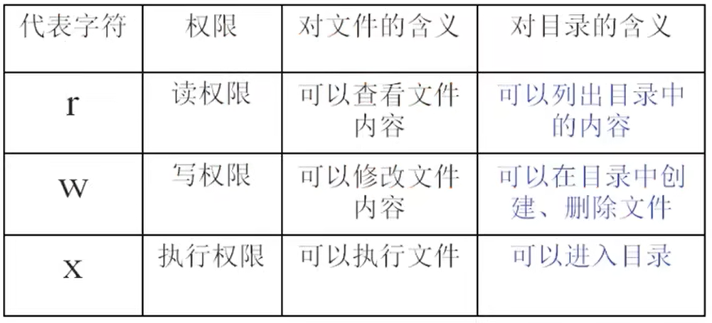

# 权限管理命令  

- [权限管理命令](#权限管理命令)
  - [文件或目录的权限](#文件或目录的权限)
  - [改变文件或目录的权限](#改变文件或目录的权限)

---

## 文件或目录的权限  

```Linux
文件类型:
- 二进制类型
d 目录
l 软链接文件

-rw-r--r--:  
第一个字符表示文件类型 -,d,l
后面的字符表示组的权限: 每三个一组  每组为rwx, 如果某位为-，即该组没有这个权限
     -  rw-   r--   r--
         u     g     o
    u: 所有者 
    g: 所属组
    o: 其他人
    
     r: 读   w: 写  x: 执行  -代表没有这个权限
```  

---

## 改变文件或目录的权限  

修改权限只能由**所有者**和**管理员$root$**  

```Linux
功能：
chmod 修改文件或目录的权限 --> change the permissions mode of a file 

语法：
chmod [{ugoa}{+-=}{rwx}] [文件或目录]  给u/g/o/all,增加(+)减少(-)修改(=)权限(rwx)
      [mode=42] [玩家或目录]
      -R 递归修改
例如：
使用加减等号方式：
chmod u+r,g-r,o+w test 将test权限中u加上r权限，g减去r权限，o加上w权限  
chmod o=rwx test 将test权限中o改成rwx，不管之前权限为多少

使用数组表示(二进制)：--> 多数使用
r=4,w=2,x=1---> rwx=7...

chmod 732 test 将权限修改为rwx-wx-w-
chmod -R 732 test 递归修改目录以及目录下的所有文件或目录的权限 

useradd [用户] 添加用户
```  

  

```Linux
file: r：cat/more/head/tail/less 看文件内容
      w：vim 写
      x:script/command 运行脚本或命令

directory: r: ls 显示目录
           w: touch/mkdir/rmdir/rm 可以创建删除文件或目录
           x：cd 进入目录
```  

---
