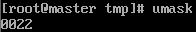

# 其他权限命令  

- [其他权限命令](#其他权限命令)
  - [改变文件和目录的所有者](#改变文件和目录的所有者)
  - [改变文件或目录的所属组](#改变文件或目录的所属组)
  - [显示，设置文件的缺省权限](#显示设置文件的缺省权限)
    - [0022](#0022)

---

## 改变文件和目录的所有者  

```Linux
功能：
chown 改变文件和目录的所有者 --> change file ownership  

语法：
chown [用户] [文件或目录] 将文件或目录的所有者修改为某用户
例如：
chown father test 将test的所有者修改为father
```  

---

## 改变文件或目录的所属组  

```Linux
功能：
chgrp 改变文件或目录的所属组 --> change file group ownership 

语法：
chgrp [用户组] [文件或目录] 将文件或目录的所属组修改为某用户组 
所属组中的所有组员对文件享有文件的权限
groupadd 添加用户组
例如： 
chgrp father test 将test文件的所属组修改为father 
```

---

## 显示，设置文件的缺省权限  

```Linux
功能：
umask 显示，修改文件的缺省权限 --> the user file-creation mask 
Linux新创建的文件中，可执行权限都没有

语法：
umask [-S] 
      -S 以rwx形式显示新建文件缺省权限 
```

### 0022  

  

```Linux
0 特殊权限 
777 rwx rwx rwx
022 --- -w- -w- ---> 777-022=755
即：
rwx r-x r-x --> 目录创建时的权限  
rwx r-- r-- --> 文件创建时的权限
```

---
