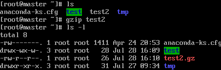
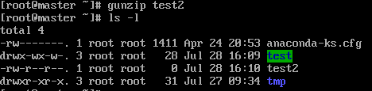
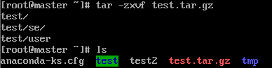
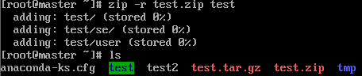
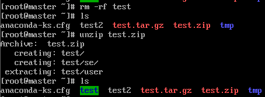

# 压缩解压文件  

---

## `gzip`压缩文件`.gz`  

```Linux
功能：
gzip 将文件压缩为.gz格式   ---> 只能压缩文件，不能压缩目录

语法：
gzip [文件] 
例如：
gzip test2 将test文件压缩为.gz格式，不保留原文件
```  

  

---

## `gunzip 和 gzip -d`解压`.gz`  

```Linux
功能：
gunzip,gzip -d 解压缩 

语法：
gunzip [压缩文件] 
gzip -d [压缩文件] 
例如：
gunzip test2.gz 价格test2.gz解压 
```  

  

---

## `tar`打包目录以及解包  

```Linux
功能：
tar 打包目录和解包

打包语法：
tar [-zcf] [压缩后文件名] [目录] 
    -c 打包
    -v 显示那些文件被打包
    -f 指定压缩后文件名
    -z 打包同时压缩  --> 文件格式为 .tar.gz
例如：
tar -zcf test.tar test 将test目录打包为test.tar并压缩为test.tar.gz

解包语法：
tar [-xvfz] 包或压缩包
    -x 解包
    -v 显示详细信息
    -f 指定解压文件
    -z 解压缩
例如：
tar 
```

  

  

---

## `zip`压缩`.zip`  

```Linux
功能：
zip 压缩文件或目录  压缩后保存原文件 

语法：
zip [-r] [压缩后的文件名] [文件或目录]
    -r 压缩目录 
例如：
zip -r test.zip test 将目录test压缩为test.zip
```

  

---

## `unzip`解压缩`.zip`  

```Linux
功能：
unzip 解压缩.zip文件 

语法：
unzip test.zip 将test.zip解压缩
```  

  

---

## `bzip2`压缩为`.bz2`  

```Linux
功能：
bzip2 将文件压缩为.bz2

语法：
bzip2 [-k] [文件] 
      -k 产生压缩文件后保留原文件
例如：
bzip2 -k test2 将test2文件压缩为test2.bz2
tar -cjf test2.tar.bz2 test2 将test2玩家压缩为test2.tar.bz2 
```  

---

## `bunzip2`解压缩`.bz2`  

```Linux
功能：
bunzip2 将.bz2文件解压缩

语法：
bunzip2 [-k] [压缩文件] 
        -k 解压缩后保留原文件
bunzip2 -k test2.bz2 将test2.bz2解压缩
tar -xjf test2.tar.bz2 将test2.tar.bz2解压缩
```  

---
