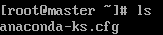
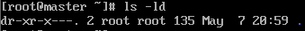

# 命令格式和目录处理命令  

- [命令格式和目录处理命令](#命令格式和目录处理命令)
  - [命令格式](#命令格式)
  - [目录处理命令](#目录处理命令)
    - [显示目录](#显示目录)
    - [文件类型以及文件权限](#文件类型以及文件权限)
    - [创建目录](#创建目录)
    - [切换目录](#切换目录)
    - [显示当前目录](#显示当前目录)
    - [删除空目录](#删除空目录)
    - [复制文件或目录](#复制文件或目录)
    - [剪切文件或目录](#剪切文件或目录)
    - [删除文件或目录](#删除文件或目录)

## 命令格式

```linux
命令格式：命令 [-选项] [参数] 
    例如： ls -la /etc  显示/etc中的文件
-a --> -all 
-l --> -long  
-lh 人性化显示 比如显示内存大小:1205-->1.2k 
```  

## 目录处理命令

### 显示目录

```Linux
功能:
ls ---> 即list 显示目录文件

语法:
ls [-ald] [文件/目录]    可以搭配 ls -a/-l/-d/-al/-ad/ald/-ld [文件/目录]
ls -a [] 显示所有的文件，包含隐藏文件
ls -l [] 详细信息显示
ls -d [] 查看目录属性信息 显示当前目录本身，不显示文件下的内容 一般和-l一起使用
ls -i [] 显示文件和目录的索引号
```  

`la []`：显示所有文件，不包含隐藏文件



`ls -a []`：显示所有的文件，包含隐藏文件


`ls -l []`：显示详细的信息
一条信息中表示为: 文件类型 + 文件权限 + 文件计数 + 文件所有者 + 文件所属组 + 文件大小 + 文件最后修改时间 + 文件名

  

`ls -d []`：显示目录本身的信息



`ls -i []`：显示文件和目录的索引号  


### 文件类型以及文件权限

```Linux
文件类型:
- 二进制类型
d 目录
l 软链接文件

-rw-r--r--:  
第一个字符表示文件类型 -,d,l
后面的字符表示组的权限: 每三个一组  每组为rwx, 如果某位为-，即该组没有这个权限
     -  rw-   r--   r--
         u     g     o
    u: 所有者 
    g: 所属组
    o: 其他人
    
     r: 读   w: 写  x: 执行  -代表没有这个权限
```  

### 创建目录  

```Linux
功能:
mkdir 创建目录  --> make directories

语法：
mkdir [-p] [目录名]
-p 指递归创建 例如: mkdir -p /temp/test 如果temp没有创建，先创建temp再创建test
```  

### 切换目录

```Linux
功能：
cd 切换目录 --> change directory

语法：
cd [目录]
例如： cd /tmp/Japan   cd .. 返回上级目录   
```  

### 显示当前目录  

```Linux
功能：
pwd 显示当前目录 

语法：
pwd [目录]
例如: pwd /root
```  

### 删除空目录  

```Linux
功能：
rmdir 删除目录  --> remove empty directories

语法：
rmdir [目录]  目录必须为空目录，不然会报错
```  

### 复制文件或目录  

```Linux
功能：
cp 复制文件或目录 --> copy
复制的时候可以更名

语法：
cp [-rp] [原文件或目录] [目标目录]  复制文件时不需要加-r,复制目录需要-r
-r 复制目录
-p 保留文件的属性
可复制多个文件 cp [-rp] [] [] []... [目标文件]
例如：
cp -r /temp/Japan /root  复制目录
cp -p /temp/Japan /root  复制并覆盖，属性相同
cp -r /temp/Japan /root/top  复制目录并更名
```  

### 剪切文件或目录  

```Linux
功能：
mv 剪切并复制 --> move
剪切后复制时可以改名 

语法：
mv [原文件或目录] [目标文件]
可以再当前目录下移动，即改名  mv Japan japan 
```  

### 删除文件或目录  

```Linux
功能：
rm 删除文件 --> remove
Linux 里面删除没有回收站

语法：
rm [-rf] [文件或目录]
-r 删除目录
-f 强制执行 --> 没有是否删除的询问
例如：
rm -rf /temp/Japan 删除目录 没有询问 如果没有-f的话，会递归去询问你是否删除
```  
