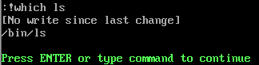

# vim 使用技巧  

- [vim 使用技巧](#vim-使用技巧)
  - [导入文件命令](#导入文件命令)
  - [应用命令](#应用命令)
  - [导入命令执行结果](#导入命令执行结果)

---

## 导入文件命令  

```Linux
:r 文件名  将文件中的内容导入到当前文件中

例如：
:r /etc/issue 将/etc/issue文件中的内容导入到当前文件中
```  

## 应用命令  

```Linux
:!which [命令] 应用一个命令

例如：
:!which ls 告诉你该命令所在的位置
```

  

---

## 导入命令执行结果  

```Linux
:r !命令 将命令执行的结果导入到文件中

例如：
:r !date 将当前时间导入到文件中
```  

---
