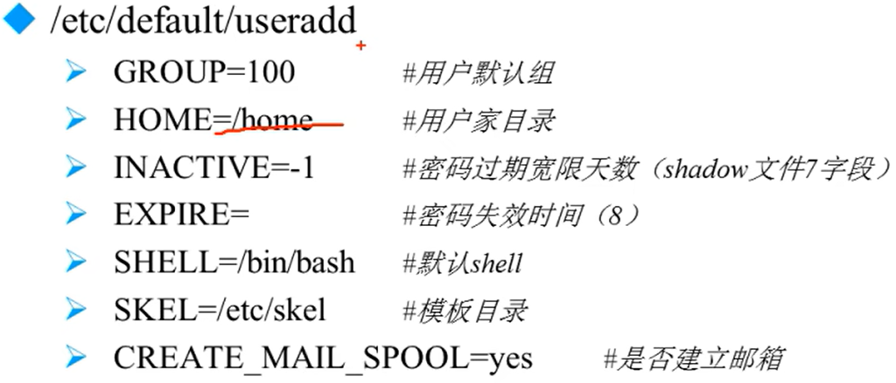
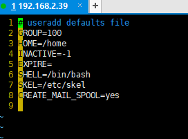
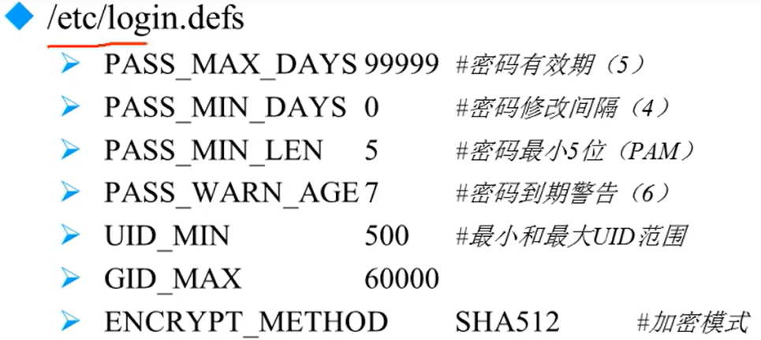
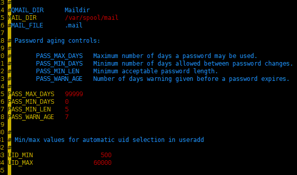

# 用户管理命令

---

## 1. 用户添加命令`useradd`

### 1.1 添加目录`useradd`

```Linux
useradd [选项] 用户名
        -u UID：手工指定用户的UID号
        -d 家目录：手工指定用户的家目录
        -c 用户说明：手工指定用户的说明
        -g 组名：手工指定用户的初始组
        -G 组名：指定用户的附加组
        -s shell：手工指定用户的登录shell。默认是/bin/bash

例如：
useradd -u 666 -G root,bin -d /yuanlang -c "test" -s /bin/bash  yuanlang
```

### 1.2 用户默认值文件

```Linux
/etc/default/useradd
```





```Linux
/etc/login.defs
```





---

## 2. 修改用户密码`passwd`

### 2.1 查看自己是谁

```Linux
whoami 查看当前用户
```

### 2.2 `passwd`命令格式

```Linux
passwd [选项] 用户名
       -S 查询用户的密码状态，仅root用户可用
       -l 暂时锁定用户，仅root用户可用
       -u 解锁用户，即root用户可用
       --stdin 可以通过管道符输出的数据作为用户的密码
```

---

## 3. 修改用户信息`usermod`及用户密码状态`chage`

### 3.1 修改用户信息`usermod`

```Linux
usermod [] 用户名
        -u UID      修改用户的UID号
        -c 用户说明  修改用户的说明信息
        -G 组名      修改用户的附加组
        -L          临时锁定用户(lock)
        -U          解锁用户锁定(unlock)
```

### 3.2 修改用户密码状态`chage`

```Linux
chage [选项] 用户名
```


---

## 4. 删除用户`userdel`和用户切换命令`su`

### 4.1 删除用户`userdel`

```Linux
userdel [-r] 用户名
        -r 删除用户的同时删除用户家目录
```

### 4.2 切换用户身份`su`

```Linux
su [选项] 用户名
   -： 选项只使用'-'代表连带用户的环境变量一起切换
   -c： 仅执行一次命令，而不切换用户身份

例如：
su - root -c "useradd user3" 不切换用户，在root权限下添加用户
``
