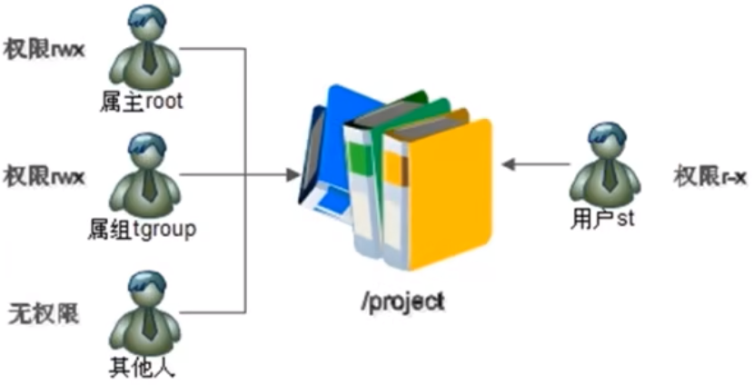
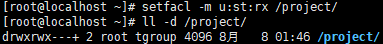
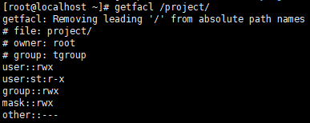

# 查看与设定

- [查看与设定](#查看与设定)
  - [1. 查看`ACL`命令](#1-查看acl命令)
  - [2. 设定`ACL`权限的命令](#2-设定acl权限的命令)
  - [3. 给用户设定`ACL`权限](#3-给用户设定acl权限)

---

## 1. 查看`ACL`命令

```Linux
getfacl 文件名 查看ACL权限
```

## 2. 设定`ACL`权限的命令

```Linux
setfacl 选项 文件名
        -m  设定ACL权限
        -x  删除指定的ACL权限
        -b  删除所有的ACL权限
        -d  设定默认ACL权限
        -k  删除默认ACL权限
        -R  递归设定ACL权限
```

---

## 3. 给用户设定`ACL`权限



```Linux
举例设定ACL权限：
mkdir project 添加一个测试目录
useradd a 添加a用户
groupadd tgroup 添加tgroup用户
useradd b 添加b用户
gpasswd -a a tgroup 把a用户添加到tgroup用户组中
gpasswd -a b tgroup 把b用户添加到tgroup用户组中
chown root:tgroup /project/  修改project目录的用户组为tgroup
chmod 770 /project/ 修改project目录的权限为770
useradd st 添加测试用户
passwd st 设置密码
setfacl -m u:st:rx /project/ 设定ACL权限 
getfacl /project/ 查看ACL权限
```

设定`ACL`权限后的，目录权限后面多了一个`+`号


查看设定好的ACL权限

