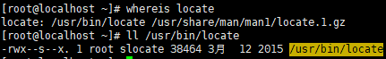
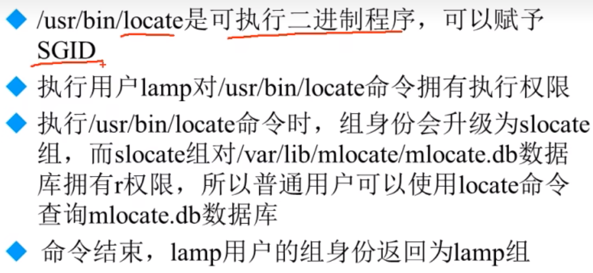

# 文件特殊权限-`SetGID`

- [文件特殊权限-`SetGID`](#文件特殊权限-setgid)
  - [1. `SetGID`针对文件的作用](#1-setgid针对文件的作用)
  - [2. `SetGID`针对目录的作用](#2-setgid针对目录的作用)
  - [3. 设定`SGID`](#3-设定sgid)
  - [4. 取消`SGID`](#4-取消sgid)

---

## 1. `SetGID`针对文件的作用


`locate`命令由于SGID权限的





---

## 2. `SetGID`针对目录的作用


---

## 3. 设定`SGID`

```Linux
chmod 2755 文件名
chmod g+s 文件名
```

---

## 4. 取消`SGID`

```Linux
chmod 755 文件名
chmod g-s 文件名
```
