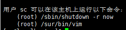

# `sudo`权限

- [`sudo`权限](#sudo权限)
  - [1. `sudo`权限](#1-sudo权限)
  - [2. `sudo`使用](#2-sudo使用)
  - [3. 授权`sc`用户可以重启服务器](#3-授权sc用户可以重启服务器)

---

## 1. `sudo`权限


---

## 2. `sudo`使用

```Linux
visudo  查看修改/etc/sudoers文件
```


---

## 3. 授权`sc`用户可以重启服务器

```Linux
过程：
visudo 加入后添加
添加:
sc ALL=/sbin/shutdown -r now 给sc用户所有IP地址下赋予shutdown命令
```


**给一个IP地址用户**`vim`**权限**  `-->` **很危险的操作** ：

```Linux
例如给sc用户在192.168.2.39地址下vim权限
sc 192.168.2.39=/sur/bin/vim
```


