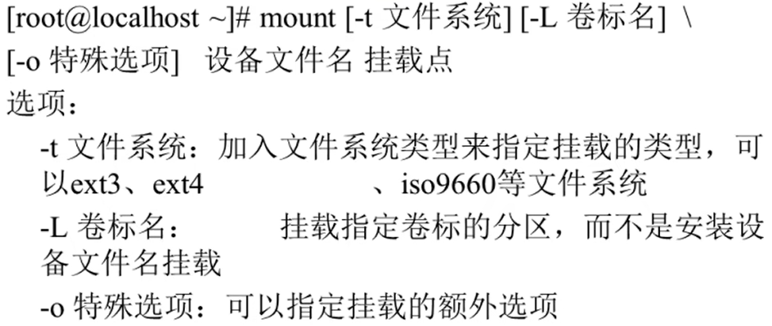

# 挂载命令

- [挂载命令](#挂载命令)
  - [1. 查询和自动挂载](#1-查询和自动挂载)
  - [2. 挂载命令格式](#2-挂载命令格式)

---

## 1. 查询和自动挂载

```Linux
mount [-l] 显示已经挂载的设备 
      -l 显示卷标

mount -a 根据配置文件/etc/fstab的内容，自动挂载
```

---

## 2. 挂载命令格式



---
