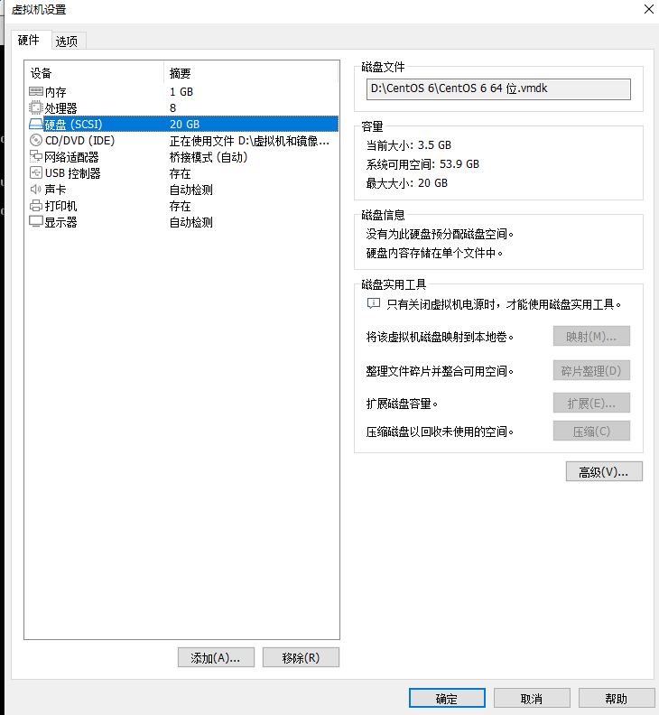

# `fdisk`分区

- [`fdisk`分区](#fdisk分区)
  - [1. 添加新硬盘](#1-添加新硬盘)
  - [2. 查看新硬盘](#2-查看新硬盘)
  - [3. 使用`fdisk`命令分区](#3-使用fdisk命令分区)
  - [4. 重新读取分区表信息](#4-重新读取分区表信息)
  - [5. 格式化分区](#5-格式化分区)

---

## 1. 添加新硬盘



---

## 2. 查看新硬盘

```Linux
fdisk -l
```

---

## 3. 使用`fdisk`命令分区

```Linux
fdisk /dev/sdb
```


---

---

## 4. 重新读取分区表信息

```Linux
partprobe 
```

---

## 5. 格式化分区

```Linux
mkfs -t ext4 /dev/sdb1
```
