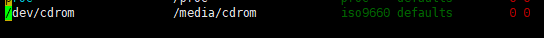

# 自动挂载与`fstab`文件修复

- [自动挂载与`fstab`文件修复](#自动挂载与fstab文件修复)
  - [1. `/etc/fstab`文件](#1-etcfstab文件)
  - [2. 分区自动挂载](#2-分区自动挂载)
  - [3. `/etc/fstab`文件修复](#3-etcfstab文件修复)

---

## 1. `/etc/fstab`文件


---

## 2. 分区自动挂载

```Linux
在/etc/fstab中写入分区
```



---

## 3. `/etc/fstab`文件修复

```Linux
mount -o remount,rw /
```

---
