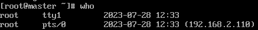

# 用户管理命令  

- [用户管理命令](#用户管理命令)
  - [`useradd`](#useradd)
  - [`passwd`](#passwd)
  - [`who`](#who)
  - [`uptime`](#uptime)

---

## `useradd`  

```Linux
功能：
useradd 添加新用户

语法：
useradd [用户] 
例如：
useradd yuanlang  添加yuanlang 用户
```

---

## `passwd`  

```Linux
当添加用户后，可以为用户设置密码  

功能：
passwd 设置用户密码  

语法：
passwd [用户名] 
例如：
passwd yuanlang 设置yuanlang的密码 
```  

---

## `who`  

```Linux
功能：
who 查看登录信息 可以查看远程登录

语法： 
who 查看登录信息 
登录信息分为登录用户名 登录终端{tty(本地终端)，pts(远程终端)}  登录时间 ip地址
```  

---

  

## `uptime`  

```Linux
uptime 查看登录情况，在线时长等
```  

---
