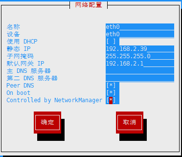
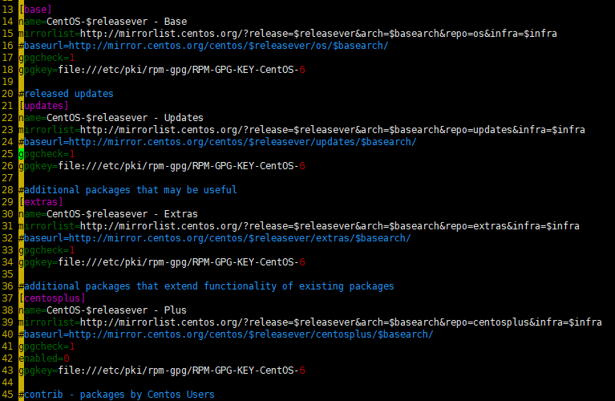
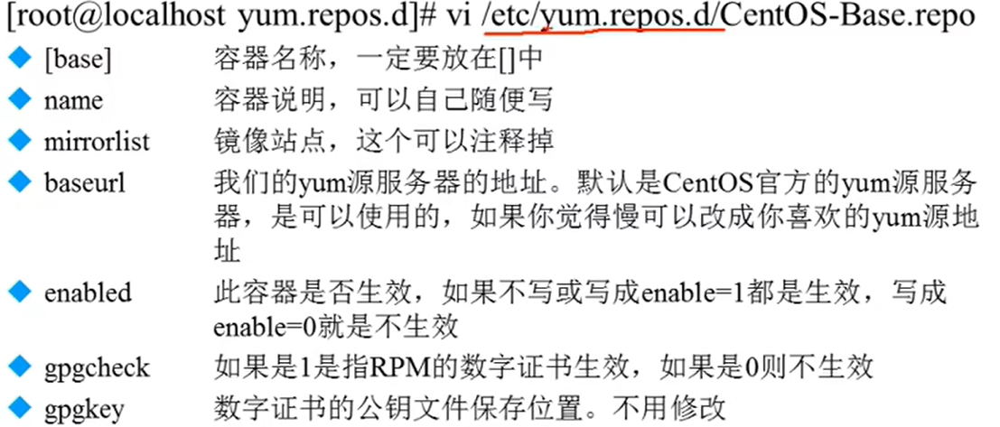
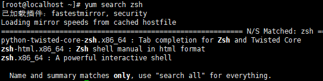
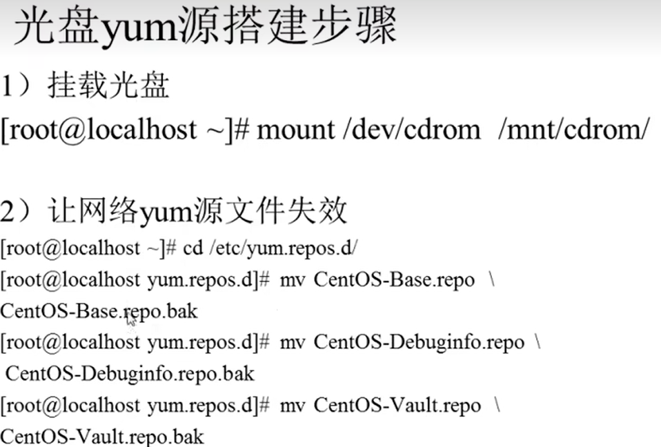
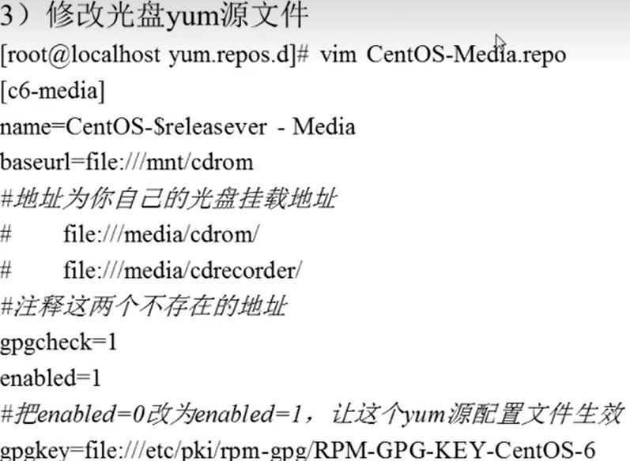

# yum在线管理

---

## IP地址配置和网络yum源

### IP地址配置

```Linux
临时更改：
ifconfig etho ip 临时生效

配置更改
setup 进入配置修改
vi /etc/sysconfig/network-scripts/ifcfg-eth0  把ONBOOT="no"修改为"yes",即启动网卡
service network restart 重启网络服务
```

  

### 网络yum源






---

## yum命令

### 查询

```Linux
yum list 查询所有可用软件包列表

yum search 关键字 搜索服务器上所有和关键字相关的包

例如：
yum search zsh
```



### 安装

```Linux
yum -y install 包名
    install 安装
    -y 自动回答yes

例如：
yum -y install gcc 安装gcc软件包
```


### 升级(不安全)

```Linux
yum -y update 包名
    update 升级
    -y 自动回答yes

例如:
yum -y update 升级所有，包含Linux内核，会出现服务器崩溃
```  

### 卸载(不安全)

```Linux
yum -y remove 包名  无法依赖问题，用yum卸载会出现系统崩溃，使用rpm卸载
    remove 卸载
    -y 自动回答yes
```

### yum软件组管理命令

```Linux
yum grouplist  列出所有可用的软件组列表
yum groupinstall 软件组名 
yum groupremove 软件组名
```

---

## 光盘yum源搭建
  




光盘yum源里面的包无法更新

---
