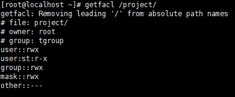
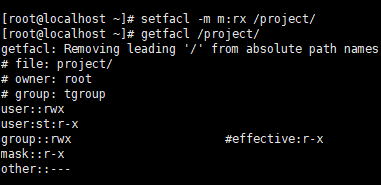

# 最大有效权限和删除

- [最大有效权限和删除](#最大有效权限和删除)
  - [1. 最大有效权限`mask`](#1-最大有效权限mask)
  - [2. 删除`ACL`权限](#2-删除acl权限)

---

## 1. 最大有效权限`mask`



```Linux
mask指定最大有效权限
真正权限为ACL权限 & mask权限 --> r-x & rwx = r-x
```

可以通过修改mask权限来修改用户ACL权限



---

## 2. 删除`ACL`权限

```Linux
setfacl -x u:用户名 文件名 删除指定文件的ACL权限
setfacl -x g:组名 文件名   删除指定用户组的ACL权限
setfacl -b 文件名 删除文件的所有的ACL权限
```
