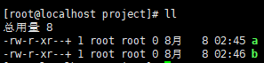
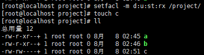

# 默认与递归`ACL`权限

- [默认与递归`ACL`权限](#默认与递归acl权限)
  - [1. 递归`ACL`权限](#1-递归acl权限)
  - [2. 默认`ACL`权限](#2-默认acl权限)

---

## 1. 递归`ACL`权限

设定父目录`ACL`权限时，所有的子文件或目录都拥有相同的`ACL`权限

```Linux
setfacl -m u:用户名:权限 -R 文件名

例如：
setfacl -m u:st:rx -R /project/ 将project中的所有文件都添加st的ACL权限，和project相同
```

递归设定好后，子目录或子文件都拥有ACL权限



---

## 2. 默认`ACL`权限

```Linux
当添加一个新的文件时，让他自动拥有父目录的ACL权限

setfacl -m d:u:用户名:权限 文件名
```

设定默认权限后，添加新文件后自动设置为默认权限



---
