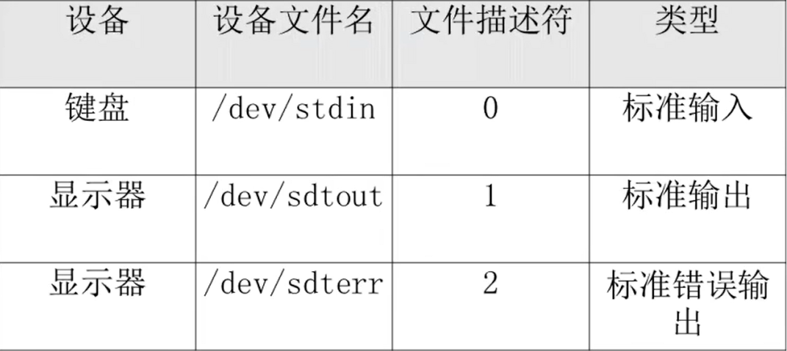
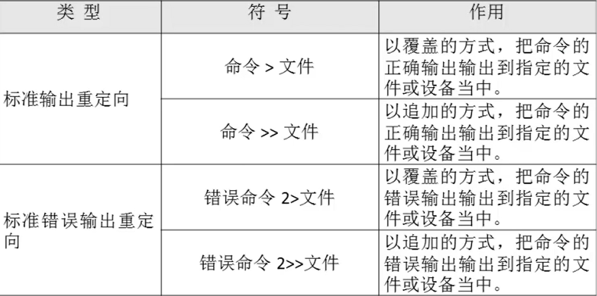
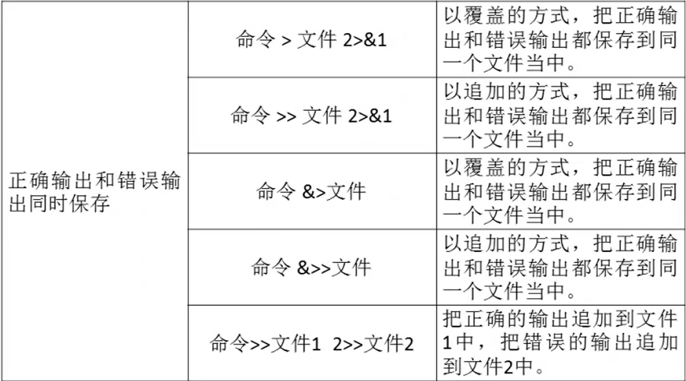

# 输入输出重定向

- [输入输出重定向](#输入输出重定向)
  - [1. 标准输入输出](#1-标准输入输出)
  - [2. 输出重定向](#2-输出重定向)
  - [3. 输入重定向](#3-输入重定向)

---

## 1. 标准输入输出



---

## 2. 输出重定向





---

## 3. 输入重定向

```Linux
wc [选项] [文件名]
   -c 统计字节数
   -w 统计单词数
   -l 统计行数
```
