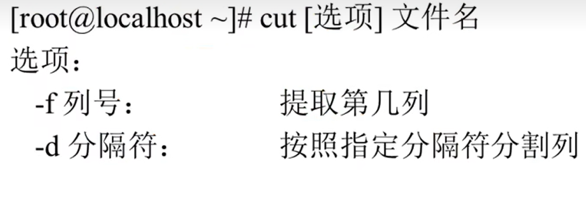
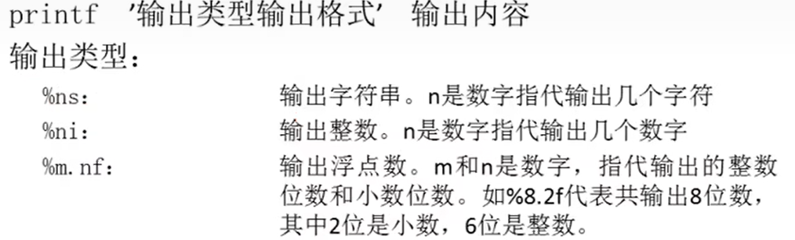
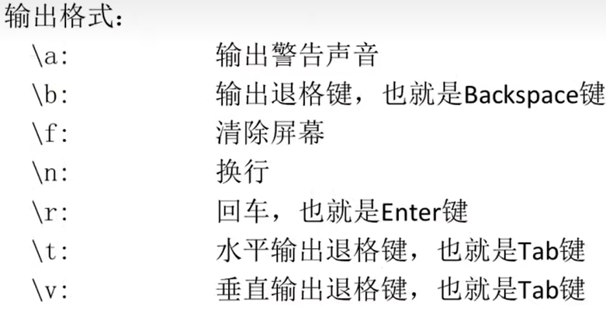
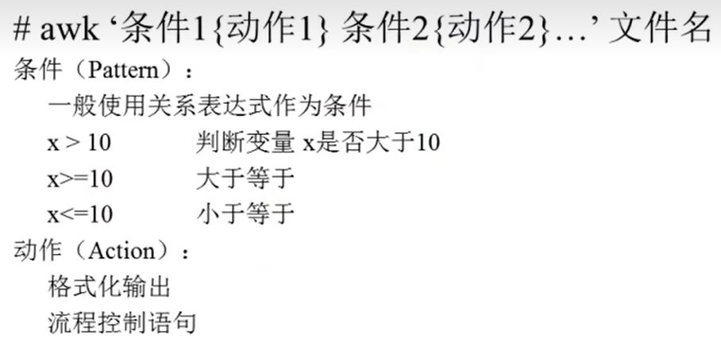
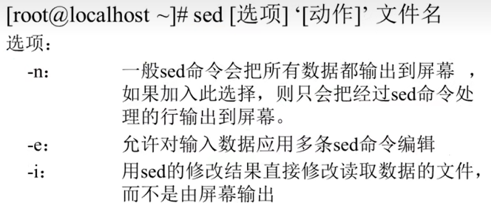
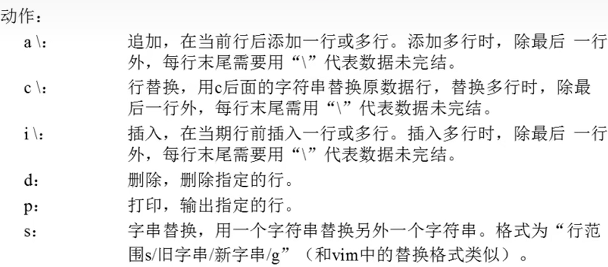

# 字符提取命令

- [字符提取命令](#字符提取命令)
  - [1. `cut`字段提取命令](#1-cut字段提取命令)
  - [2. `printf`命令](#2-printf命令)
  - [3. `awk`命令](#3-awk命令)
  - [4. `sed`命令](#4-sed命令)

---

## 1. `cut`字段提取命令

使用`cut`分割时不能用空格为分隔符



```Linux
cut -f 2 student.txt 提取student.txt文件中的第二列的内容

cut -f 1,2 student.txt 提取1,2列内容

cut -d ":" student.txt 按分号分割列  

cat /etc/passwd | grep /bin/bash | grep -v root | cut -d ":" -f 1 找用户
```

---

## 2. `printf`命令





```Linux
例如：
printf '%s %s \n' a b cd
```

---

## 3. `awk`命令

可以按空格分割



---

## 4. `sed`命令





```Linux
例如：
sed -n '2p' student.txt 查看第二行

sed '2,4d' student.txt 删除2到4行内容

sed '2c ha' student.txt 将文件的第4行替换
```

---
