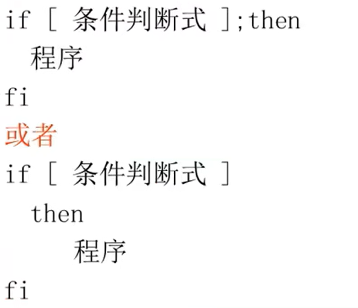

# 流程控制

- [流程控制](#流程控制)
  - [1. `if`](#1-if)
    - [1.1 `if`](#11-if)
    - [1.2 `if else`](#12-if-else)
    - [1.3 `if else - if else`](#13-if-else---if-else)
  - [2. `for`](#2-for)
  - [3. `while`](#3-while)
  - [`until`](#until)
  - [循环控制](#循环控制)

---

## 1. `if`

### 1.1 `if`



```Linux
if condition
then
    command1
    command2
    ...
fi
```

---

### 1.2 `if else`

```Linux
if condition
then 
    command1
else 
    command2
fi
```

---

### 1.3 `if else - if else`

```Linux
if condition
then 
    command1
elif 
    command2
then 
    command3
else 
    command4
fi
```

---

## 2. `for`

```Linux
for var in item1 item2 ... item
do
    command1
    command2
    command3
    ...
done
```

---

## 3. `while`

```Linux
while condition
do 
    command
done
```

---

## `until`

```Linux
until condition
do 
    command
done
```

---

## 循环控制

```Linux
break 跳出循环
continue 跳槽当前循环
```

---
