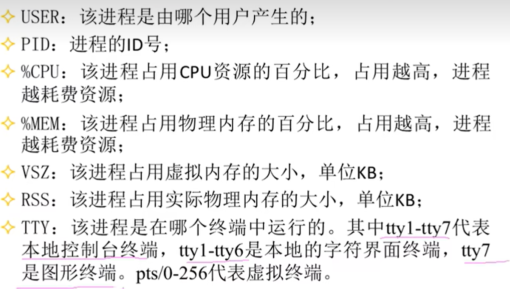
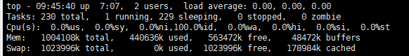
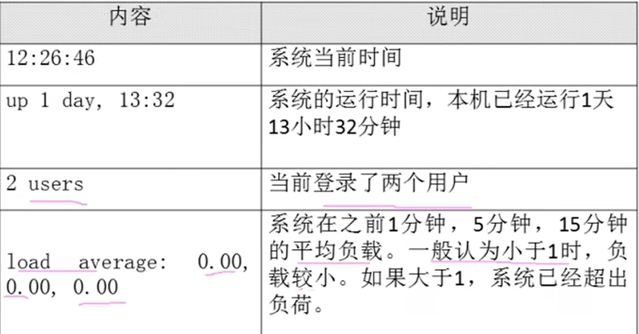
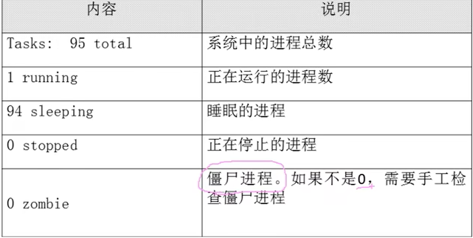
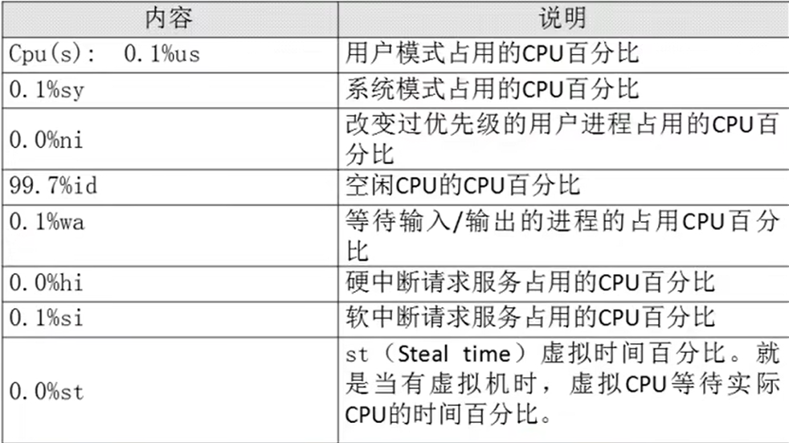
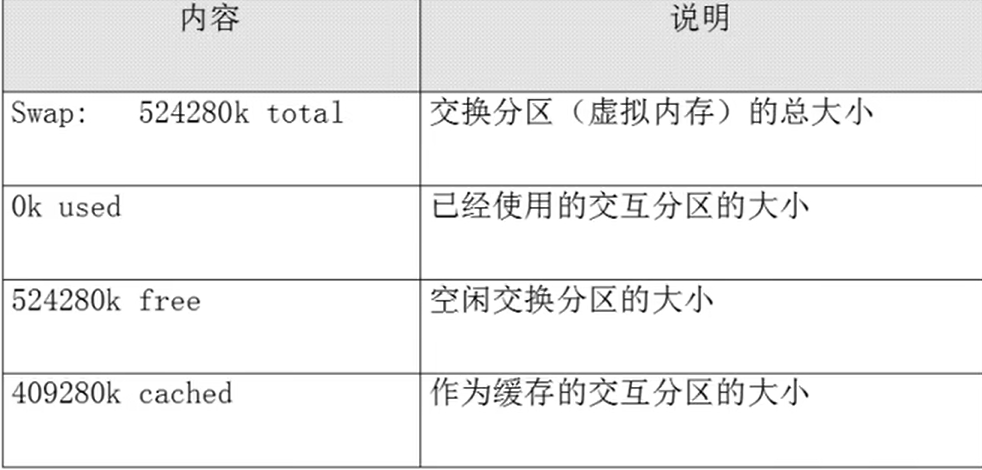
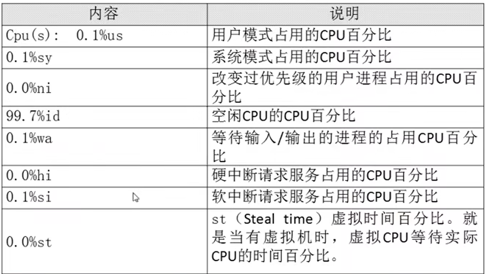

# 进程查看

- [进程查看](#进程查看)
  - [1. 查看系统中的所有进程](#1-查看系统中的所有进程)
  - [2. 查看系统健康状态](#2-查看系统健康状态)
    - [2.1 健康状态的选项](#21-健康状态的选项)
  - [3. 查看进程树](#3-查看进程树)

---

## 1. 查看系统中的所有进程

```Linux
ps aux 查看系统中的使用进程，使用BSD系统格式

ps -le 查看系统中的所有进程，使用Linux系统格式
```

**进程的信息* *：





---

## 2. 查看系统健康状态

```Linux
top [选项]
```


**健康状态**:



### 2.1 健康状态的选项

**第一行为任务队列信息**：



**第二行为进程信息**：



**第三行为CPU信息**：



**第四行为物理内存信息**：：



**第五行为交换分区的信息**：



---

## 3. 查看进程树

```Linux
pstree [选项]
```


---
