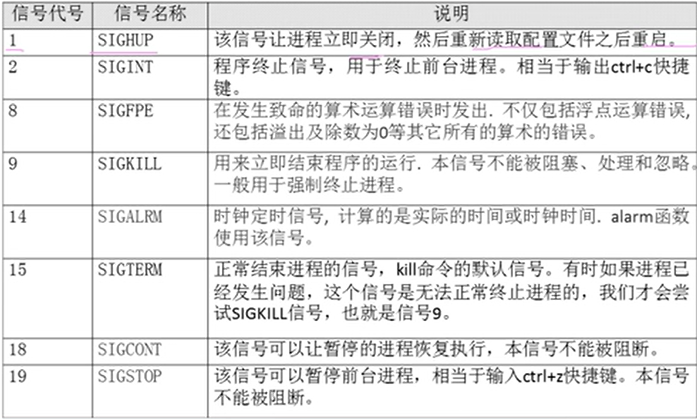
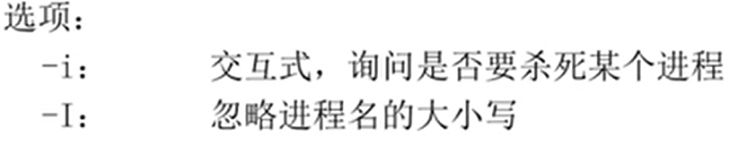
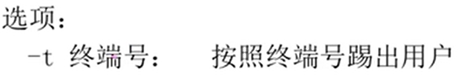

# 终止进程

- [终止进程](#终止进程)
  - [`kill`](#kill)
  - [`killall`](#killall)
  - [`pkill`](#pkill)

---

## `kill`

```Linux
kill -l 查看可用的进程号

kill -l 22354 重启

kill -9 22368 强制杀死进程
```



---

## `killall`

```Linux
killall [选项] [信号]  进程名
```



---

## `pkill`

```Linux
pkill [选项] [信号] 进程名
```



```Linux
按照终端号踢出用户
w 查询登录用户
pkill -t -9 pts/1 杀死进程
```

---
