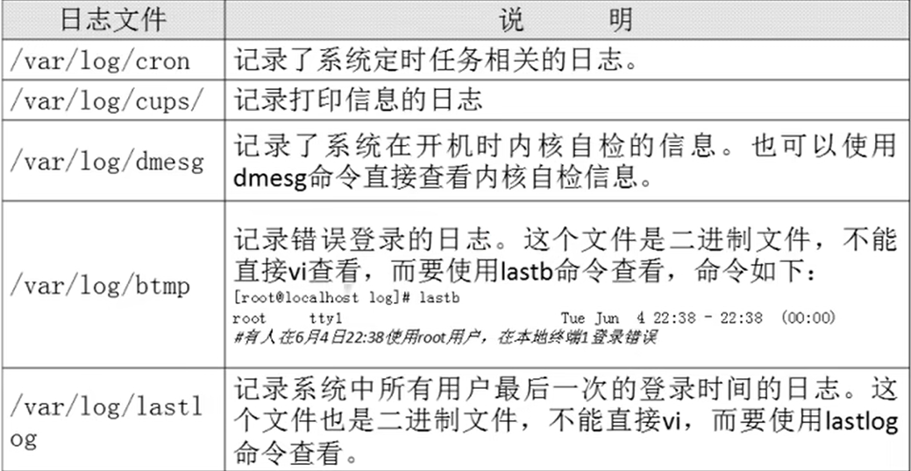
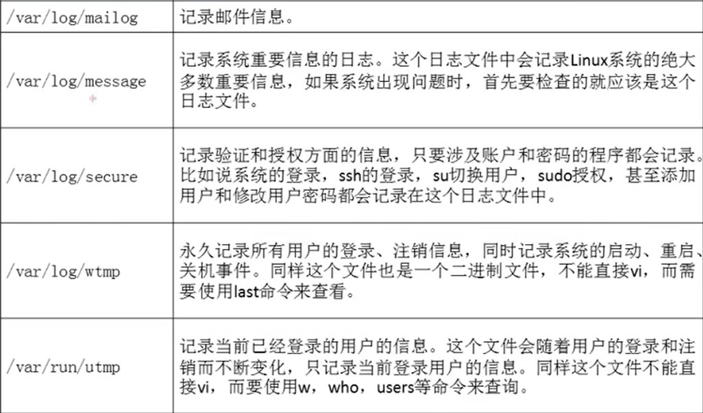

# 简介

- [简介](#简介)
  - [1. 确定服务启动](#1-确定服务启动)
  - [2. 常见日志的作用](#2-常见日志的作用)

---

## 1. 确定服务启动

```Linux
ps aux | grep rsyslogd 查看服务是否启动

chkconfig --list | grep rsyslog 查看服务是否自启动
```

---

## 2. 常见日志的作用





---
