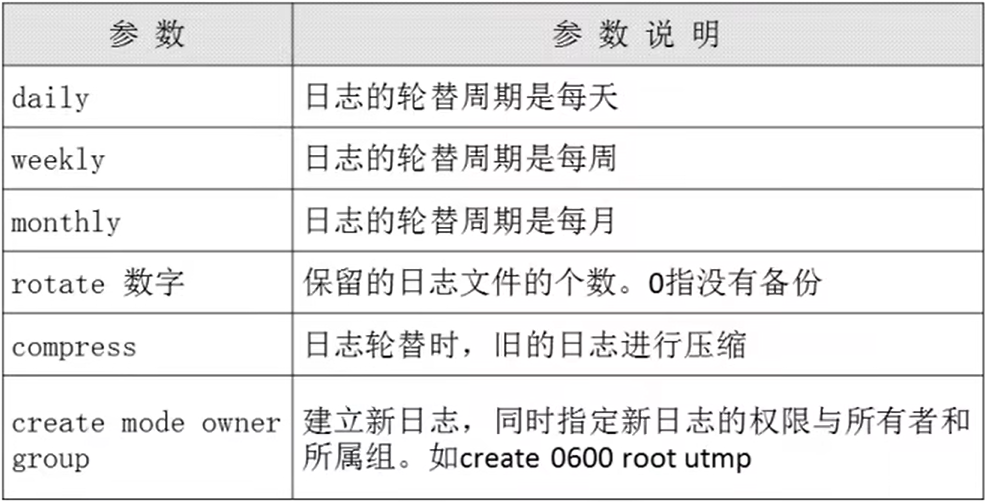
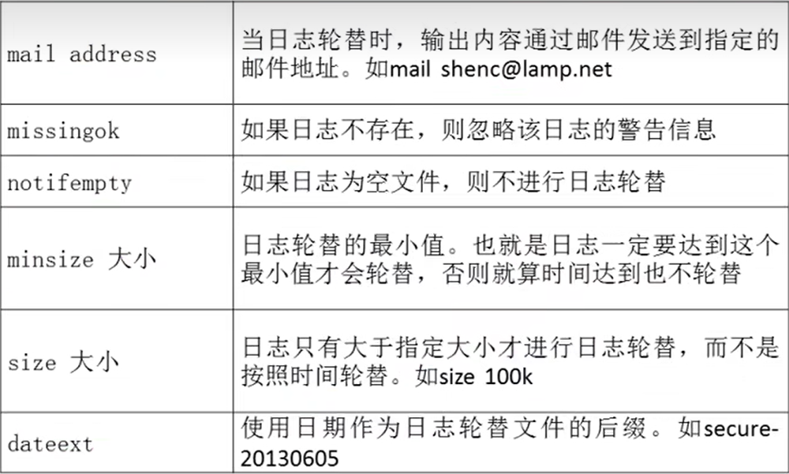

# 日志轮替

- [日志轮替](#日志轮替)
  - [1. `logrotate`配置文件](#1-logrotate配置文件)
  - [2.将日志加入到轮替](#2将日志加入到轮替)
  - [3. `logrotate`命令](#3-logrotate命令)

---

## 1. `logrotate`配置文件





---

## 2.将日志加入到轮替

```Linux
例如: 将apache日志加入轮替
vi /etc/logrotate.conf

添加:
/usr/local/apache2/logs/access_log
{
    daily
    create
    rotate 30
}
```

---

## 3. `logrotate`命令

```Linux
logrotate [选项] 配置文件名
```


---
