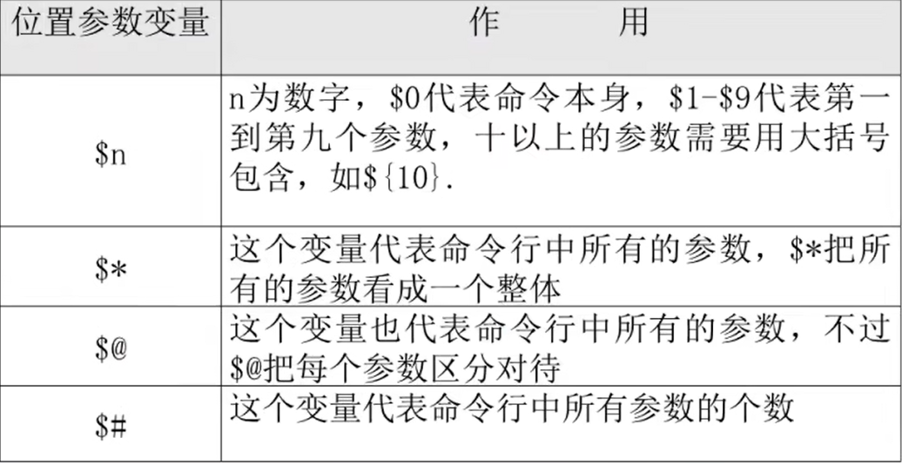
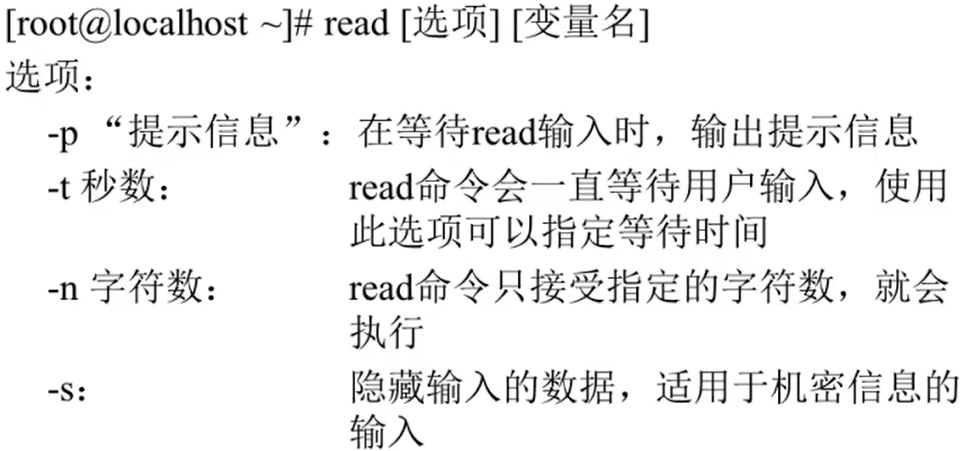

# 变量

## 1. 设置环境变量

```Linux
export 变量名=变量值   声明变量
env 查询变量
unset 变量名  删除变量
```

---

## 2. 位置参数变量



```Linux
echo $0 -> 接收第一个输入的参数

例如：在test.sh中有
echo $0 -> 代表该命令本身
echo $1
echo $2
echo $3

即：./test.sh 11 22 33 -> 对应位置赋值
```

---

## 3. 预定义变量


---

## 4. 接收键盘输入



```Linux
例如：
read -t 10 -p "please input your name:" name
echo $name

read -s -t 10 -p "please input your age" age
echo $age

reade -s -t 10 -p "[M/W]" sex
echo $sex
```

---
