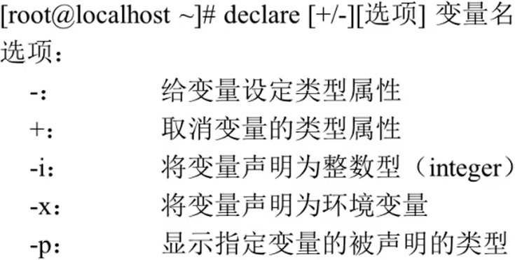
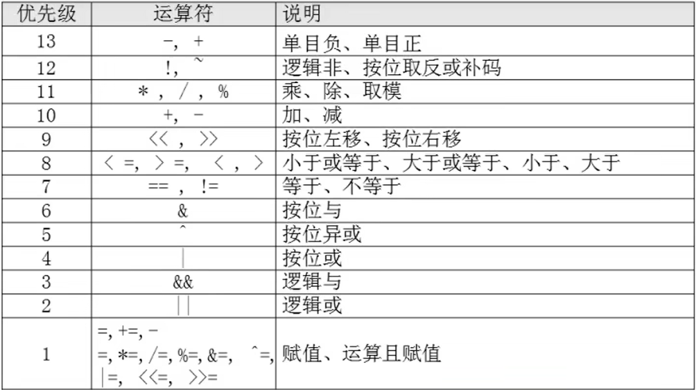

# 数值运算与运算符

- [数值运算与运算符](#数值运算与运算符)
  - [1. `declare`声明变量类型](#1-declare声明变量类型)
  - [2. 运算符](#2-运算符)

---

## 1. `declare`声明变量类型



```Linux
例如：

方式1：
aa=11
bb=22
declare cc=$aa+$bb
echo $cc

方式2：
cc=$(expr $aa + $bb)
echo $cc

方式3：
cc=$(($aa + $bb))
echo $cc
```

---

## 2. 运算符



```Linux
例如：
cc=$((1 && 1))
echo $cc
```

---
