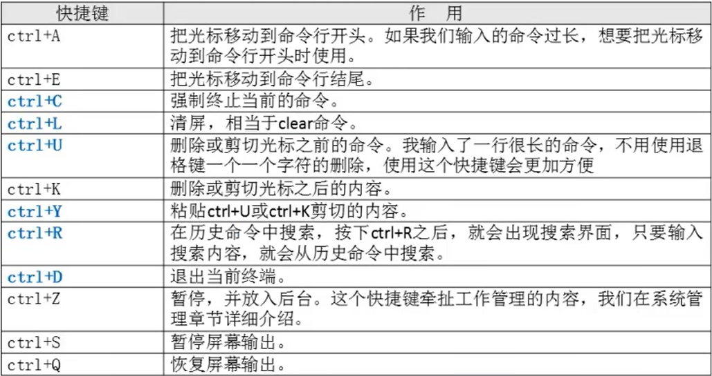

# 命令别名与快捷键

- [命令别名与快捷键](#命令别名与快捷键)
  - [1. 命令别名](#1-命令别名)
  - [2.`Bash`常用快捷键](#2bash常用快捷键)

---

## 1. 命令别名

```Linux
alias 别名='原命令' 设定命令别名         

alias 查询命令别名

vim /root/.bashrc 修改配置文件，永久更改别名
```

---

## 2.`Bash`常用快捷键



---
