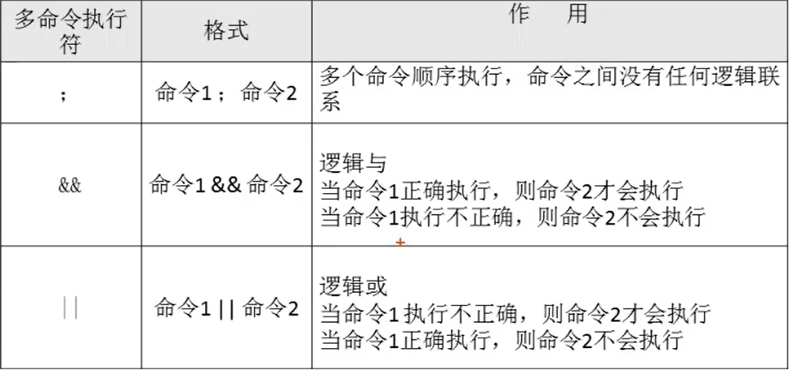
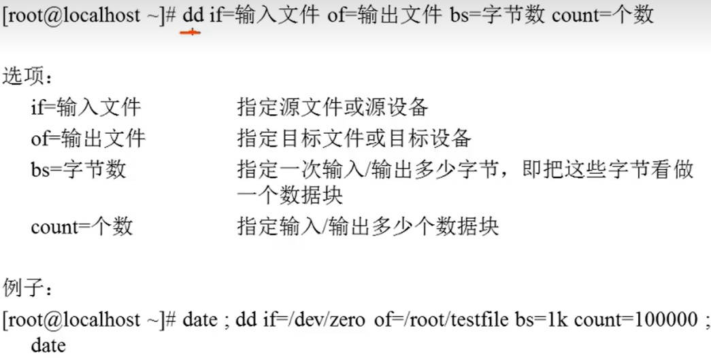

# 多命令顺序执行与管道符

- [多命令顺序执行与管道符](#多命令顺序执行与管道符)
  - [1. 多命令顺序执行](#1-多命令顺序执行)
  - [2. 磁盘复制](#2-磁盘复制)
  - [3. 管道符](#3-管道符)

---

## 1. 多命令顺序执行



---

## 2. 磁盘复制



---

## 3. 管道符

```Linux
命令1 | 命令2 命令1的正确输出作为命令2的操作对象

例如：
ll -a /etc/ | more   分页显示/etc/目录
```

---
  