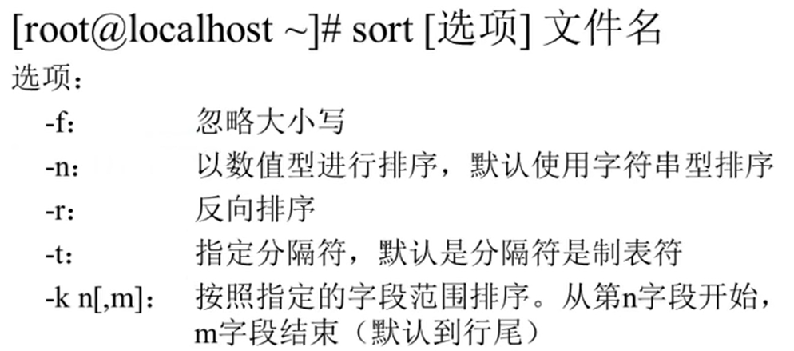
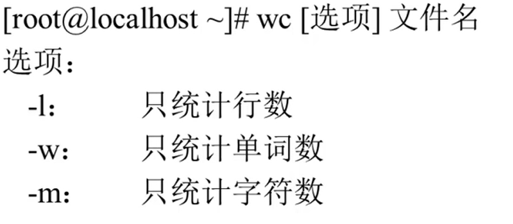

# 字符处理命令

- [字符处理命令](#字符处理命令)
  - [1. 排序命令`sort`](#1-排序命令sort)
  - [2. 统计命令`wc`](#2-统计命令wc)

---

## 1. 排序命令`sort`



```Linux
例如：
sort student.txt

sort -r student.txt 反向排序
```

## 2. 统计命令`wc`



---
