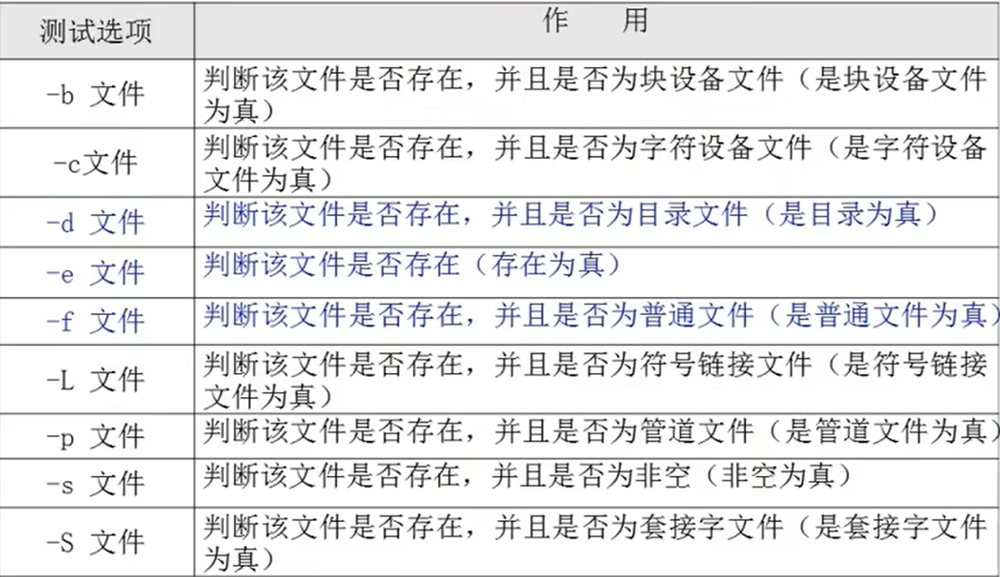
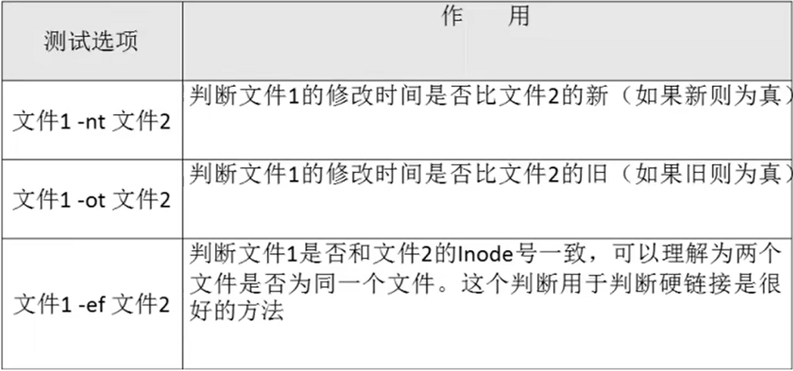
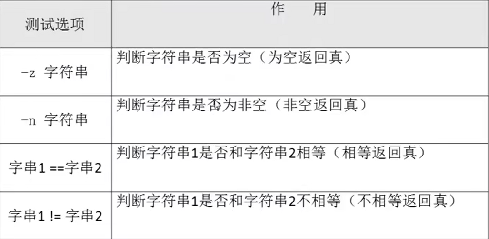
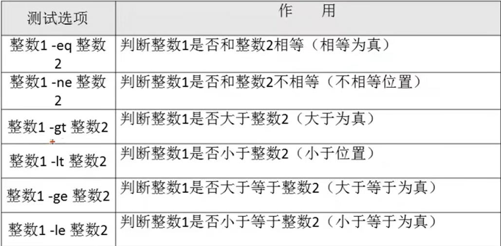

# 条件判断

---

## 1. 按照文件类型判断



---

## 2. 判断格式

```Linux
方式1：
test -e /root/install.log

方式2：
[ -e /root/install.log ]

例如：
[ -f /root ] && echo "yes" || echo "no"
```

---

## 3. 两个文件之间比较



---

---

## 4. 字符段判断



---

## 5. 两个整数判断



---
