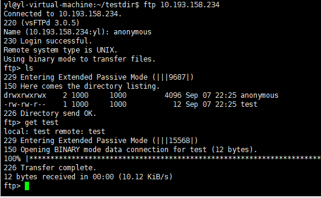

# `ftp`

- [`ftp`](#ftp)
  - [1. 安装`vsftpd`服务器](#1-安装vsftpd服务器)
  - [2. 配置`vsftpd.conf`文件](#2-配置vsftpdconf文件)
  - [3. 重启服务器,重新加载`/etc/vsftpd.conf`配置文件](#3-重启服务器重新加载etcvsftpdconf配置文件)
  - [4. 创建`ftpserver`，供用户上传](#4-创建ftpserver供用户上传)
  - [5. 测试](#5-测试)
  - [6. 操作](#6-操作)

---

## 1. 安装`vsftpd`服务器

```Linux
sudo apt-get install vsftpd
```

---

## 2. 配置`vsftpd.conf`文件

```Linux
sudo vi /etc/vsftpd.conf

更改：
anonymous_enable=YES -> 运行匿名用户
anon_root=/home/yl/ftpserver -> 先创建ftpserver
no_anon_password=YES -> 不用密码
write_enable=YES -> 可写
anon_upload_enable=YES -> 可更新
anon_mkdir_write_enable=YES
anon_umask=022 -> 权限
```

---

## 3. 重启服务器,重新加载`/etc/vsftpd.conf`配置文件

```Linux
sudo /etc/vsftpd.conf restart
```

---

## 4. 创建`ftpserver`，供用户上传

```Linux
cd ~/ftpserver
mkdir anonymous
chmod 777 anonymous
```

---

## 5. 测试

```Linux
cd ~/ftpserver
touch test
ftp 10.193.158.234  -> 加入ftp服务器
输入用户： anonymous  不用密码
get test 下载
put test 上传
```



---

## 6. 操作

```Linux
get 下载
mget 下载多个
put 上传
mput 上传多个
```
