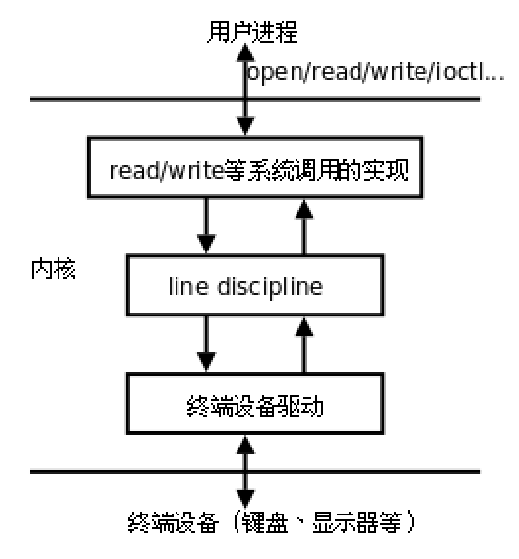

# 终端和进程组

## 1. 终端


- 每个进程都可以通过一个特殊的设备文件`/dev/tty`访问它的控制终端
- 每个终端都对应一个不同的设备文件

```c
ttyname(int fd);   获取指向终端设备文件的文件名
```



`line discipline`：线路规程，特殊按键会在线路规程截获，解释成信号

### 1.1 网络终端


---

## 2. 进程组

一个或多个进程的集合，进程组ID为一个整数，一般为父进程的ID

### 2.1 获得当前进程组组ID

```c
pid_t getpgid(pid_t pid);
pid_t getpgrp(void);
```

```c
#include <stdio.h>
#include <unistd.h>
#include <sys/types.h>
#include <stdlib.h>

int main(void)
{
    pid_t pid;
    pid = fork();
    if(pid < 0){
        perror("fork");
        exit(1);
    }
    else if(pid == 0){
        // child
        printf("child process PID is %d\n", getpid());
        printf("Group ID os %d\n", getpgrp());
    }
    else{
        // parent
        printf("parent process PID is %d\n", getpid());
        printf("Group ID os %d\n", getpgrp());
    }

    return 0;
}
```

**组长进程**：进程组ID = 进程ID

组长进程创建一个进程组，创建该进程组中的进程，组长进程终止，进程组还是存在

**进程组生存期**：

进程组创建到最后一个进程终止或转移

**一个进程为自己或子进程设置进程组ID**:

```c
#include <unistd.h>

int setpgid(pid_t pid, pid_t pgid)
    如改变子进程为新的组，在fork后，exec前使用
    非root进程只能改变自己创建的子进程，或有权限操作的进程

例如：
setpgid(100,100);  自己成立一个组，并且自己为组长
setpgid(100,200);  将100加入到200的组内，200已经存在
```
