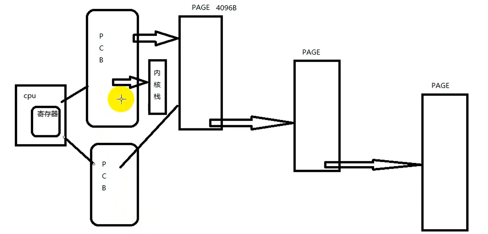
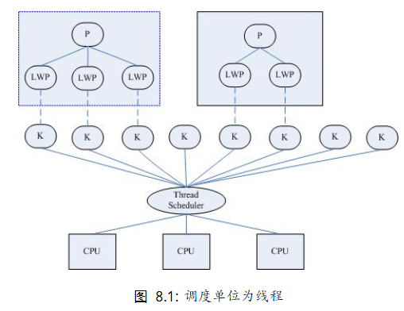
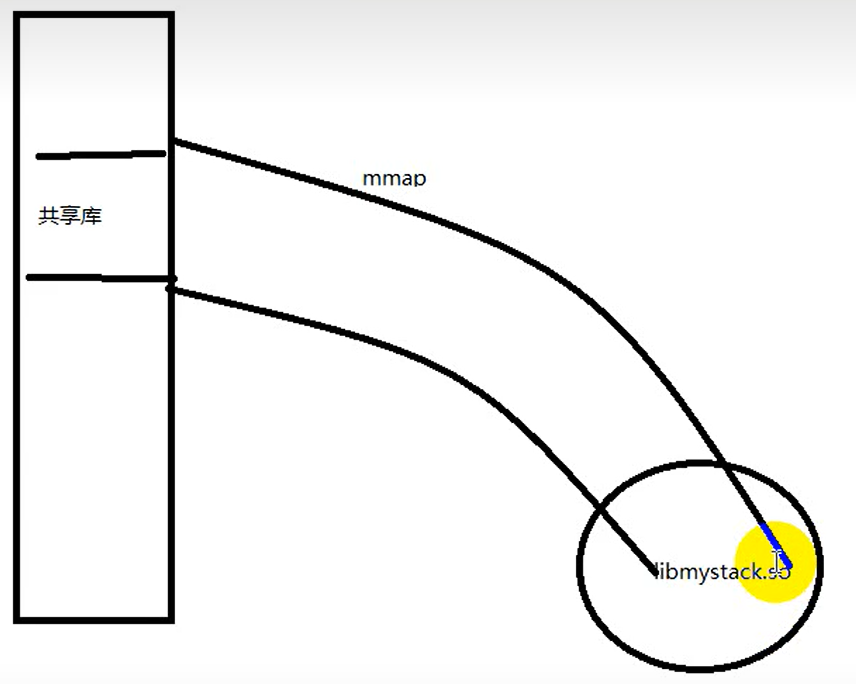
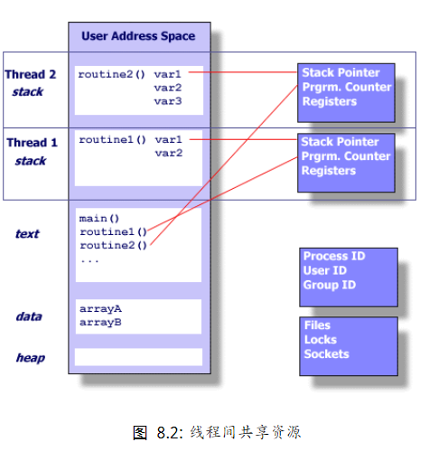

# 线程概念

- [线程概念](#线程概念)
  - [1. 线程与进程之间的关系](#1-线程与进程之间的关系)
  - [2. 线程间共享资源](#2-线程间共享资源)
  - [3. 线程间非共享的资源](#3-线程间非共享的资源)
  - [4. 线程优缺点](#4-线程优缺点)

---

## 1. 线程与进程之间的关系

- 轻量级进程，也有`PCB`，创建线程使用的底层函数和进程相同，都是`clone`
- 内核上看线程和进程相同，都有不同的`PCB`,当时`PCB`指向的内存资源的三级页表相同
- 进程可以变为线程
- 线程就是寄存器和栈
- 在Linux中，线程是最小的执行单位，进程为最小的分配资源单位



查看`LWP`号

```c
ps -Lf pid 查看一个进程的线程有哪些

ps -eLf 查看线程信息
```



---

## 2. 线程间共享资源

- 文件描述符
- 每种信号的处理方法
- 当前工作目录
- 用户ID和组ID
- 内存地址空间
- `Text`, `data`, `bss`, 堆, 共享库

将磁盘上的共享库，映射到地址空间上



线程自己的栈不共享



---

## 3. 线程间非共享的资源

- 线程id
- 处理器现场与栈指针(内核栈)
- 独立的栈空间(用户空间栈)
- `errno`变量
- 信号屏蔽字
- 调度优先级

---

## 4. 线程优缺点

**优点**：

- 提高程序的并发性
- 开销小，不用重新分配内存
- 通信和共享数据方便

**缺点**：

- 线程不稳定(库函数实现)
- 线程调试比较困难(gdb支持不好)  --> 依赖经验
- 线程无法使用`unix`经典事件，如信号

---
