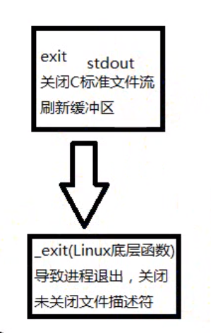

# 进程原语

- [进程原语](#进程原语)
  - [1. `pthread_create`创建线程](#1-pthread_create创建线程)
  - [2. `pthread_self`获取调用线程的`tid`](#2-pthread_self获取调用线程的tid)
    - [2.1 主线程中`pthread_create`返回值`tid` 是否等于 `pthread_self`得到的`tid`](#21-主线程中pthread_create返回值tid-是否等于-pthread_self得到的tid)
  - [3. `pthread_exit`退出当前调用线程](#3-pthread_exit退出当前调用线程)
  - [4. `pthread_join`回收线程](#4-pthread_join回收线程)
  - [5. `pthread_cancel`取消其他线程](#5-pthread_cancel取消其他线程)
  - [6. `pthread_detach`线程分离态](#6-pthread_detach线程分离态)
  - [7. `pthread_equal`判断两个线程是否相等](#7-pthread_equal判断两个线程是否相等)

---

## 1. `pthread_create`创建线程

创建一个线程

```c
#include <pthread.h>

int pthread_create(pthread_t *thread, const pthread_attr_t *attr,
                    void *(*start_routine) (void *), void *arg);

Compile and link with -pthread.  去链接pthread库


pthread_t *thread：传递一个 pthread_t变量地址进来，用于保存新进程的tid(线程ID)

const  pthread_attr_t *attr：线程属性设置，可以设置线程的栈和优先级等，使用默认属性，则和NULL

void *(*start_routine)(void *)：函数指针，指向新线程应该加载执行的函数模块

void *arg：指定线程将要加载调用的那个函数的参数 

返回值： 成功返回0，失败返回错误号，以前学过的系统函数都是成功返回0，失败返回-1，而错误号保存在全局变量errno中，而pthread库的函数都是通过返回值返回错误号，虽然每个线程也都有一个errno，但这是为了兼容其它函数接口而提供的，pthread库本身并不使用它，通过返回值返回错误码更加清晰。
```

---

## 2. `pthread_self`获取调用线程的`tid`

```c
#include <pthread.h>

pthread_t pthread_self(void);
```

**例子**：

```c
#include <stdio.h>
#include <pthread.h>
#include <fcntl.h>
#include <sys/types.h>
#include <sys/stat.h>
#include <unistd.h>

void *th_fun(void *arg)
{
    int *p = (int *)arg;
    printf("thread PID is %d\n", getpid());
    printf("thread ID is %x\n", (unsigned int)pthread_self());
    printf("thread *arg is %d\n", *p);
}

int main(void)
{
    pthread_t tid;
    int n = 10;
    pthread_create(&tid, NULL, th_fun, (void*)&n); // 1. 创建线程 2. 将信号填到tid
                                                   //  3. 返回函数调用
    printf("main PID is %d\n", getpid());
    printf("main thread ID %x\n", (unsigned int)pthread_self());
    printf("main child thread ID is %d\n", (unsigned int)tid);

    return 0;
}
```

### 2.1 主线程中`pthread_create`返回值`tid` 是否等于 `pthread_self`得到的`tid`

- 不一定，当出现创建好一个线程后，先去执行线程，当线程执行完毕后，`tid`无意义，通过`pthread_t`传回得`tid`同时无意义

任何线程调用`exit 或 _exit`都会导致进程退出，所有线程终止  



---

## 3. `pthread_exit`退出当前调用线程

调用线程退出函数，与`exit`区别，任何线程中执行`exit`都会导致进程终止， 而`pthread_exit`只会退出当前调用进程

```c
 #include <pthread.h>

void pthread_exit(void *retval);    

void *retval: 线程退出时得参数，可以是退出值和地址，如是地址，不能是线程内申请的局部地址

Compile and link with -pthread.
```

**注意**：

- `pthread_exit`或`return`返回的指针指向的内存单元必须是全局或者`malloc`分配的，因为当线程终止后，对应线程内申请的局部变量就会被释放

---

## 4. `pthread_join`回收线程

回收线程的`PCB`

```c
#include <pthread.h>

int pthread_join(pthread_t thread, void **retval);

Compile and link with -pthread.

pthread_t thread：回收线程的tid
void **retval：接收退出线程传递出的返回子
返回值：成功返回0，失败放回错误号
```

调用该函数的线程将挂起等待，直到`id`为`thread`的线程终止。`thread`线程以不同的方法
终止，通过`pthread_join`得到的终止状态是不同的，总结如下：

- 如果`thread`线程通过`return`返回，`retval`所指向的单元里存放的是`thread`线程函数的返
回值。
- 如果`thread`线程被别的线程调用`pthread_cancel`异常终止掉，`retval`所指向的单元里存
放的是常数`PTHREAD_CANCELED`。
- 如果`thread`线程是自己调用`pthread_exit`终止的，`retval`所指向的单元存放的是传给
`pthread_exit`的参数。
- 如果对`thread`线程的终止状态不感兴趣，可以传`NULL`给`retval`参数。

---

## 5. `pthread_cancel`取消其他线程

在一个进程内，某个线程可以去取消另一个线程

```c
 #include <pthread.h>

int pthread_cancel(pthread_t thread);

Compile and link with -pthread.
```

被取消的线程退出值为常数`PTHREAD_CANCELED`，值为-1

实例：

```c
#include <stdio.h>
#include <unistd.h>
#include <sys/stat.h>
#include <sys/types.h>
#include <pthread.h>
#include <stdlib.h>

void *th_fn1(void *arg)
{
    printf("thread 1 writing\n");
    return (void*)1;
}

void *th_fn2(void *arg)
{
    printf("thread 2 writing\n");
    pthread_exit((void*)2); 
}

void *th_fn3(void *arg)
{
    while(1){
    printf("thread 3 writing\n");
    sleep(1);
}`
}

int main(void)
{
    pthread_t tid;
    void *tret;
    pthread_create(&tid, NULL, th_fn1, NULL);
    pthread_join(tid, &tret);
    printf("thread 1 exit code %d\n", (int)(size_t)tret);

    pthread_create(&tid, NULL, th_fn2, NULL);
    pthread_join(tid, &tret);
    printf("thread 2 exit code %d\n", (int)(size_t)tret);

    pthread_create(&tid, NULL, th_fn3, NULL); 
    sleep(2);
    pthread_cancel(tid);  // 取消tid进程
    pthread_join(tid, &tret);  // 返回PTHREAD_CANCELED = -1
    printf("thread 3 exit code %d\n", (int)(size_t)tret);  

    return 0;
}
```

---

## 6. `pthread_detach`线程分离态

```c
#include <pthread.h>

int pthread_detach(pthread_t thread);

Compile and link with -pthread.

放回值：成功返回0，失败返回errno
```

- 一般情况下，线程终止后，终止状态会保留到有进程调用`pthread_join`来回收
- 设置为`detach`状态后，线程终止就会被回收，并且不保留终止状态
- 对于一个处于`detach`状态的线程调用`pthread_join`，会返回`EINVAL`，所以调用了`pthread_detach`就不能在调用`pthread_join`

**举例**：

```c
#include <stdio.h>
#include <pthread.h>
#include <errno.h>
#include <string.h>
#include <stdlib.h>
#include <unistd.h>

void *th_fn(void *arg)
{
    int n = 3;
    while(n--){
        printf("thread count %d\n", n);
        sleep(1);
    }
    return (void*)1;
}

int main(void)
{
    pthread_t tid;
    void *tret;
    int err;
    pthread_create(&tid, NULL, th_fn, NULL);

    pthread_detach(tid);  // 将进程分离态
    while(1){
        err = pthread_join(tid, &tret);
        if(err != 0){
            fprintf(stderr, "thread %s\n", strerror(err));
        }
        else{
            fprintf(stderr, "thread exit code %d\n", (int)(size_t)tret);
        }
        sleep(1);
    }

    return 0;
}

```

---

## 7. `pthread_equal`判断两个线程是否相等

比较两个线程是否相等

```c
#include <pthread.h>

int pthread_equal(pthread_t t1, pthread_t t2);

Compile and link with -pthread.
```

---
