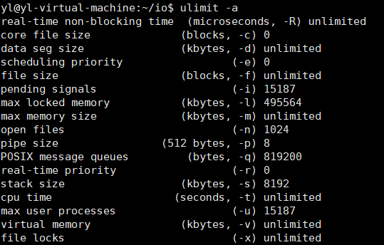

# 线程属性

- [线程属性](#线程属性)
  - [1. 线程属性介绍](#1-线程属性介绍)
  - [2. 通过`ulimit -s`修改栈的大小](#2-通过ulimit--s修改栈的大小)
  - [3. 线程属性初始化](#3-线程属性初始化)
  - [4. 线程的分离状态](#4-线程的分离状态)
  - [5. 线程的栈](#5-线程的栈)
  - [6. 练习](#6-练习)
  - [7. `NPTL`](#7-nptl)
    - [7.1 查看当前`pthread`版本](#71-查看当前pthread版本)
    - [7.2 `NPTL`实现机制(`POSIX`)](#72-nptl实现机制posix)
    - [7.3 使用线程库时`gcc`指定 `-lpthread`](#73-使用线程库时gcc指定--lpthread)

---

## 1. 线程属性介绍

一般用默认属性，当需要更高的程序性能时，可以设置线程属性，比如通过设置线程栈的大小来降低内存的使用，增加最大线程的个数

```c
typedef struct
{
int etachstate; //线程的分离状态
int schedpolicy; //线程调度策略   --> 设置优先级
structsched_param schedparam; //线程的调度参数  --> 设置优先级
int inheritsched; //线程的继承性
int scope; //线程的作用域
size_t guardsize; //线程栈末尾的警戒缓冲区大小
int stackaddr_set; //线程的栈设置
void* stackaddr; //线程栈的位置
size_t stacksize; //线程栈的大小
}pthread_attr_t;
注：目前线程属性在内核中不是直接这么定义的，抽象太深不宜拿出讲课，为方便大家理解，使用早期的线程属性
定义，两者之间定义的主要元素差别不大。
```

通过相关函数进行属性设置操作，初始化函数为`pthread_attr_init`，必须在`pthread_create`函数之前调用，之后需要用`pthread_attr_destroy`函数来释放资源

属性包括：

- 作用域(`scope`)，栈尺寸(`stack size`)，栈地址(`stack address`)，优先级(`priority`)，分离的状态(`detached state`)，调度策略和参数(`scheduling policy and parameters`)。默认的属性非绑定，非分离，缺省的堆栈，与父进程系统级别的优先级

---

## 2. 通过`ulimit -s`修改栈的大小



```c
ulimit -s 4096 指定堆栈大小为4096
```

---

## 3. 线程属性初始化

先初始化线程属性，再`pthread_create`创建线程

```c
#include <pthread.h>
int pthread_attr_init(pthread_attr_t *attr)
int pthread_attr_destroy(pthread_attr_t *attr)  销毁
```

---

## 4. 线程的分离状态

线程的分离状态决定一个线程以什么样的方式来终止自己

- 非分离状态:线程的默认属性是非分离状态，这种情况下，原有的线程等待创建的线程
结束。只有当pthread_join()函数返回时，创建的线程才算终止，才能释放自己占用的系统
资源。
- 分离状态:分离线程没有被其他的线程所等待，自己运行结束了，线程也就终止了，马
上释放系统资源。应该根据自己的需要，选择适当的分离状态。

```c
#include <pthread.h>

// 设置线程属性，分离 | 非分离
int pthread_attr_setdetachstate(pthread_attr_t *attr, int detachstate);

// 获取线程属性 分离 | 非分离
int pthread_attr_getdetachstate(const pthread_attr_t *attr,
                                int *detachstate);

pthread_attr_t *attr:被已初始化的线程属性
int *detachstate:可选为PTHREAD_CREATE_DETACHED（分离线程）和 PTHREAD _CREATE_JOINABLE（非分离线程）
```

**注意**：

- 如果设置一个线程为分离线程，而这个线程运行又非常快，
它很可能在`pthread_create`函数返回之前就终止了，它终止以后就可能将线程号和系统
资源移交给其他的线程使用，这样调用`pthread_create`的线程就得到了错误的线程号。

**解决方案**：

- 同步措施，最简单的方法之一是可以在被创建的线程里调用`pthread_cond_timedwait`函数，让这个线程等待一会儿，留出足够的时间让函数`pthread_create`返回。

```c
#include <stdio.h>
#include <unistd.h>
#include <string.h>
#include <pthread.h>
#include <stdlib.h>

void *th_fun(void *arg)
{
    int n = 20;
        while(n--){
            printf("%x %d\n", (int)(size_t)pthread_self, n);
            sleep(1);
        }
        return (void *)1;
    }

    int main(void)
    {
        pthread_t tid;
        pthread_attr_t attr;   // 此时attr里面时垃圾值
        int err;

        pthread_attr_init(&attr);  // attr里面为默认值
                                
        // pthread_attr_t: PTHREAD_CREATE_DETACHED 分离态
        //                 PTHREAD_CREATE_JOINABLE 非分离态
        pthread_attr_setdetachstate(&attr, PTHREAD_CREATE_DETACHED);

        pthread_create(&tid, &attr, th_fun, NULL);

        err = pthread_join(tid, NULL);

        while(1){
            if(err != 0){
                printf("%s\n", strerror(err));
                sleep(10);
                pthread_exit((void *)1);
            }
        }

    return 0;
}
```

## 5. 线程的栈

获取和设置线程的栈属性

```c
#include <pthread.h>

int pthread_attr_setstack(pthread_attr_t *attr, void *stackaddr, size_t stacksize);

int pthread_attr_getstack(pthread_attr_t *attr, void **stackaddr, size_t *stacksize);

attr 指向一个线程属性的指针
stackaddr 返回获取的栈地址
stacksize 返回获取的栈大小
返回值：若是成功返回0,否则返回错误的编号
```

---

## 6. 练习

```c
#include <stdio.h>
#include <unistd.h>
#include <stdlib.h>
#include <pthread.h>
#include <string.h>
#define SIZE 0x100000

int print_time(char *str)
{
    sleep(1);
    printf("%s\n", str);
    return 0;
}

void *th_fun(void *arg)
{
    int n = 3;
    while(n--){
        print_time("hello world!\n");
    }
}

int main(void)
{
    pthread_t tid;
    int err, detachstate, i = 1;
    pthread_attr_t attr;
    size_t stacksize;
    void *stackaddr;

    pthread_attr_init(&attr);

    /* 获取默认属性下的栈的信息 */
    pthread_attr_getstack(&attr, &stackaddr, &stacksize);
    printf("stackaddr = %p\n", stackaddr);  
    printf("stacksize = %x\n", (int)stacksize);

    /* 线程的默认属性 */
    pthread_attr_getdetachstate(&attr, &detachstate);
    if(detachstate == PTHREAD_CREATE_DETACHED){
        printf("thread detached\n");
    }
    else if(detachstate == PTHREAD_CREATE_JOINABLE){
        printf("thread join\n");
    }
    else 
        printf("thread un known\n");
    /* 设置线程的分离状态*/
    pthread_attr_setdetachstate(&attr, PTHREAD_CREATE_DETACHED);

    while(1){
        /* 设置线程的栈的大小*/
        stackaddr = malloc(SIZE);
        if(stackaddr == NULL){
            perror("malloc");
            exit(1);
        }
        stacksize == SIZE;
        pthread_attr_setstack(&attr, stackaddr, stacksize);
        /* 创建线程 */
        err = pthread_create(&tid, &attr, th_fun, NULL);
        if(err != 0){
            printf("%s\n", strerror(err));
            exit(1);
        }
        printf("%d\n", i++);
    }

    pthread_attr_destroy(&attr);

    return 0;
}
```

---

## 7. `NPTL`

### 7.1 查看当前`pthread`版本

```c
getconf GUN_LIBPTHREAD_VERSION
```

### 7.2 `NPTL`实现机制(`POSIX`)

### 7.3 使用线程库时`gcc`指定 `-lpthread`

---
