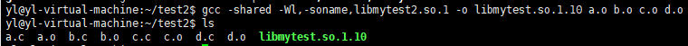

# 编译

---

## 1. `gcc`

```Linux
-v / --v / --version 查看版本号

-I<DIR> 指定头文件,I和<DIR>之间没有空格

-c 只编译,生成.o文件

-g 包含调试学习

-0n n=0~3 编译优化 n越大优化越多

-wall

-D<DEF> 编译时定义宏

-E 生成预处理文件

-M 生成.c文件与头文件依赖关系的Makefile
```

---

## 2. 静态库

```Linux
ar rcs libmylib.a file1.o
```

---

## 3. 共享库

## 3.1 创建共享库

```Linux
gcc -fFIC -c a.c
gcc -fFIC -c b.c
gcc -shared -Wl -o libmyab.so a.o b.o  -- .so 为共享库的后缀
```

```Linux
gcc -shared -Wl,-soname,libmyab.so.l -o libmyab.so.1.0.1 a.o b.o
                            |              |
                       linker name     real name
每个共享库有三个文件名: real name, soname, linker name  真正的库文件为real name 

例如:
gcc -shard -Wl,-soname,libmytest.so.1 -o libmytest.so.1.10 a.o b.o c.o d.o 
```




## 3.2 加载共享库

```Linux
当你使用到共享库中的内容时,程序无法找到共享库的位置时,要在配置文件中指定位置

sudo vim /etc/ld.so.conf  修改指定共享库路径

sudo ldconfig -v 更新查找共享库的路径 
  
例如：
gcc main.c libmytest.so.1.10 -o app 

./app 编译时要指定libmytest.so.1.10的路径
```

```Linux
假设我add.c中为加法函数: int add(int a,int b)

生成.o文件为：gcc -c add.c

将加入到共享库中： gcc -Wl,-soname,libmytest2.so.1 -o libmytest2.so.1.10 add.o

在common.h中声明add函数

然后创建main.c: 
#include <stdio.h>
#include "common.h"
int main()
{
    printf("%d\n",add(4,5));
    return 0;
}

编译： gcc main.c libmytest2.1.10 -o app

此时无法找到libmytest2.1.10 -> 即要在/etc/ld.so.conf 指定路径

然后更新配置: sudo ldconfig -v 

运行文件: ./main.c -- 成功运行
```

---
