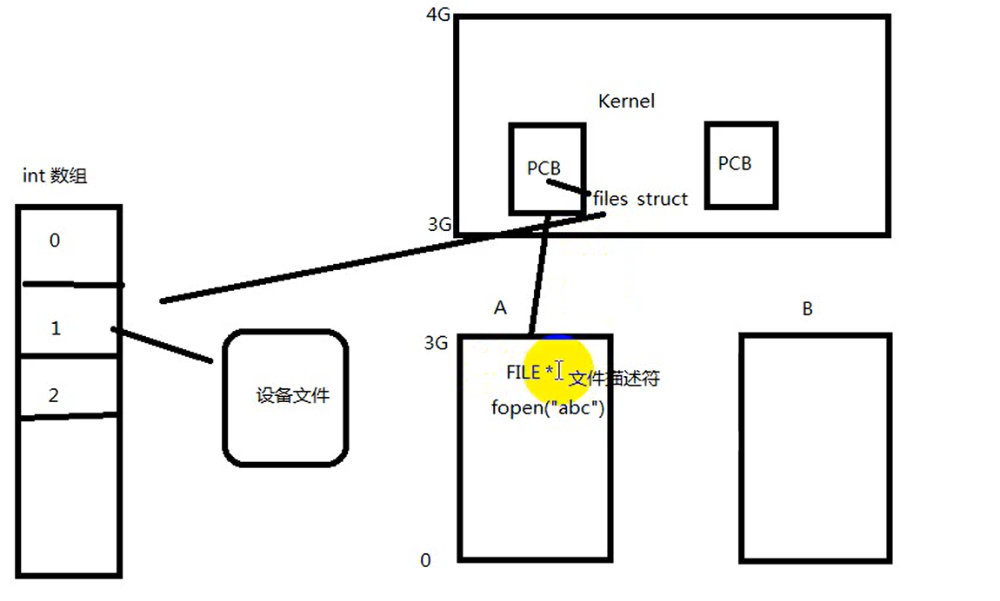

# PCB 进程控制块

- [PCB 进程控制块](#pcb-进程控制块)
  - [`task_struct`结构体](#task_struct结构体)
  - [`file struct`](#file-struct)
  - [文件描述符](#文件描述符)

---


---

## `task_struct`结构体

---

## `file struct`



---

## 文件描述符

```Linux
一个进程会默认打开3个文件描述符
STDIN_FILEND 0
STDOUT_FILEND 1
STDERR_FILEND  2 
```

新打开文件返回文件描述符中未使用的最小描述符

---
