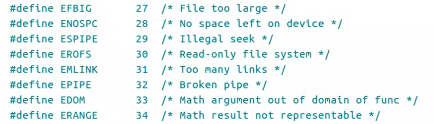
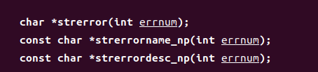

# `perror` 和 `errno`

---

## 1. `errno`

当异常报错时,错误会对应一个错误，即errno对应着错误



---

## 2. `perror`

输出对应的错误

```Linux
void perror(const char *s);     

例如：
perror("input error");
```

---

## 3. `strerror`

```Linux
char *strerror(int errnum); 放回errno对应的错误
```



---
