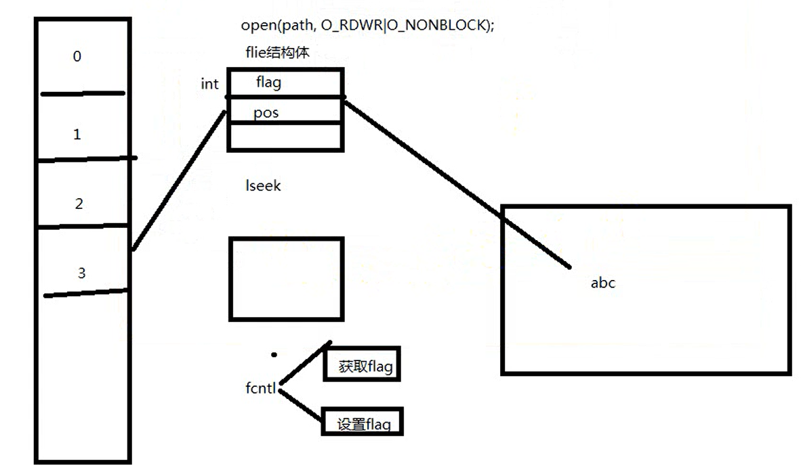
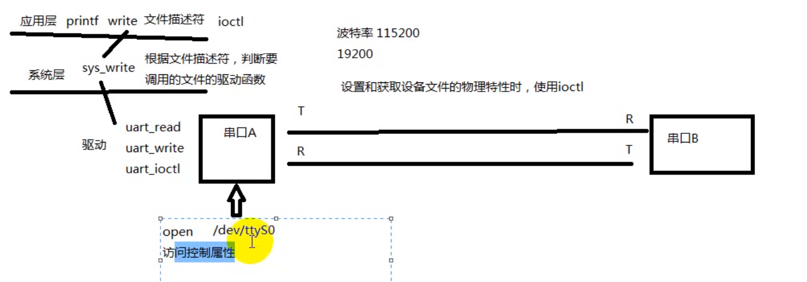
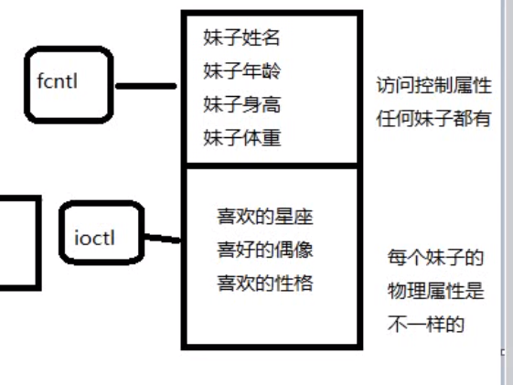

# 其余函数

---

## 1. `lseek`

```Linux
off_t lseek(int fd, off_t offset, int whence); 返回偏移量     
```

---

## 2. `fcntl`

改变一个已经打开的文件的属性，可重新设置读，写，追加，非阻塞等标志，不用重新open文件

```Linux
int fcntl(int fd, int cmd, ... /* arg */ );

例如: 
flags=fcntl(STDIN_FILENO, F_GETFL); 返回文件的属性

flags=fcntl(STDIN_FILENO, F_SETFL, flags); 将文件属性设置为flags，并返回flags
```



---

## 3. `ioctl`

传输控制信息




