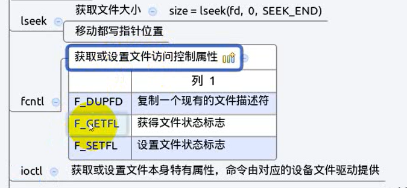

# 其余函数

- [其余函数](#其余函数)
  - [1. `lseek`](#1-lseek)
  - [2. `fcntl`](#2-fcntl)
  - [3. `ioctl`](#3-ioctl)



---

## 1. `lseek`

```Linux
off_t lseek(int fd, off_t offset, int whence); 返回偏移量     

例如：
int size=lseek(fd,0,SEEK_END); 查看文件大小
int ret=lseek(fd,1000,SEEK_END); 拓展1000个字节
```

---

## 2. `fcntl`

改变一个已经打开的文件的属性，可重新设置读，写，追加，非阻塞等标志，不用重新open文件

```Linux
int fcntl(int fd, int cmd, ... /* arg */ );

例如: 
flags=fcntl(STDIN_FILENO, F_GETFL); 返回文件的属性

flags=fcntl(STDIN_FILENO, F_SETFL, flags); 将文件属性设置为flags，并返回flags
```


---

## 3. `ioctl`

控制物理属性


```Linux
int ioctl(int fd, unsigned long request, ...);
```

---
