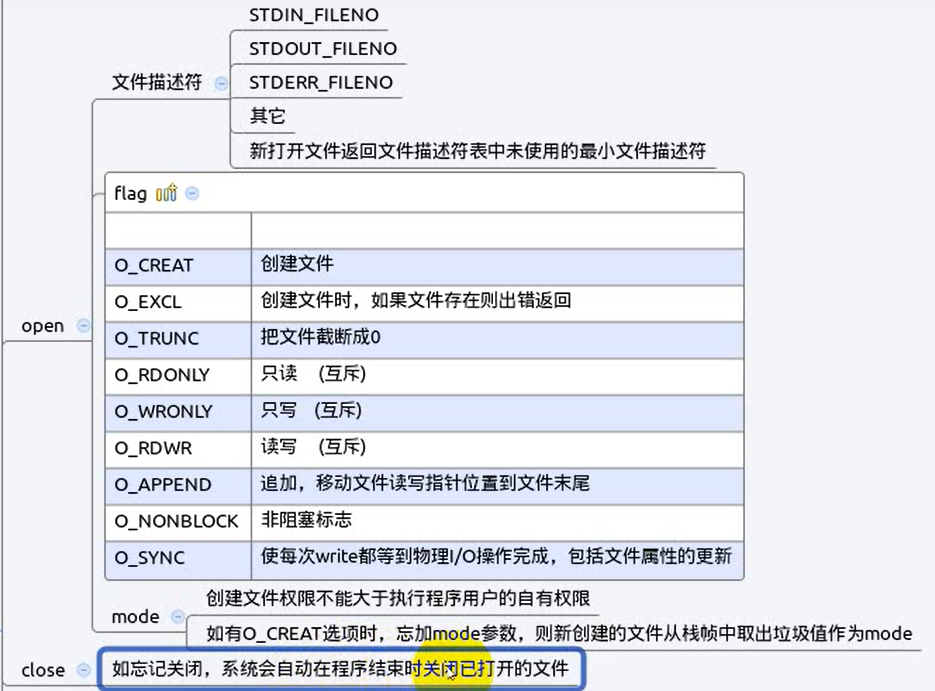
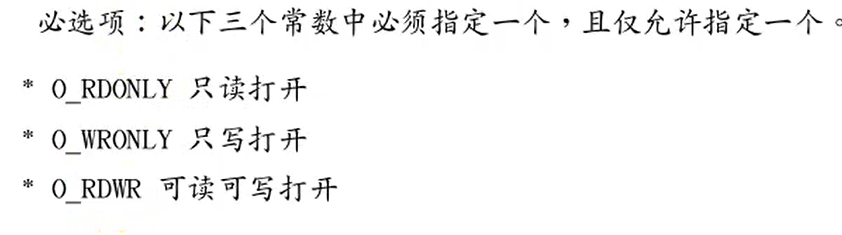
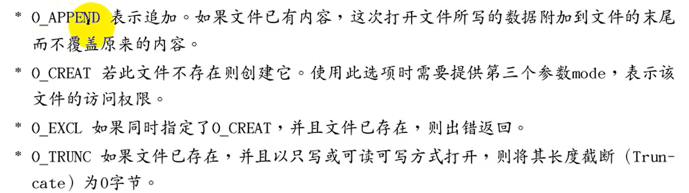

# `open` 和 `write`

- [`open` 和 `write`](#open-和-write)
  - [`open`](#open)
  - [`close`](#close)
  - [创建时的权限](#创建时的权限)



---

## `open`

Linux中`open`函数打开文件，也可以创建函数，并指定函数的权限

`man 2 open`可以看到open的详解

```Linux
int open(const char *pathname, int flags) 返回文件的描述符 
int open(const char *pathname, int flags, mode_t mode) 指定文件的权限

例如：
如果文件不存在即创建文件：
int open("abc",O_CREAT,0777)  0777为权限

int fd=open("abc",O_CREAT | O_RDWE,0777) 可对可写打开 
```





---

## `close`

```Linux
close(fd) 打开后将文件关闭
```

---

## 创建时的权限

```Linux
可以通过修改umask更改权限
```

---
