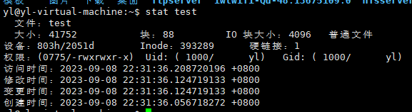
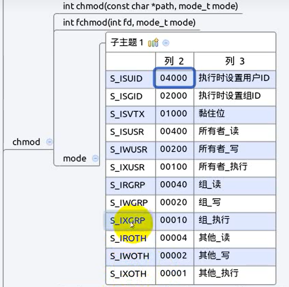
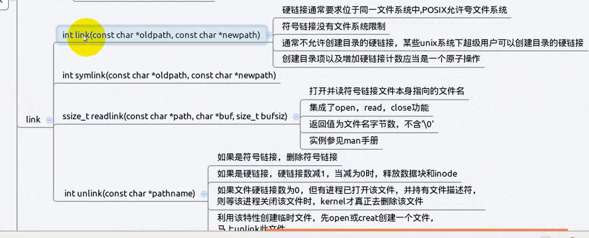

# 相关函数1

- [相关函数1](#相关函数1)
  - [1. `stat`](#1-stat)
  - [1.1 `stat`函数及命令](#11-stat函数及命令)
    - [`stat`结构体](#stat结构体)
  - [2. `access`](#2-access)
  - [3. `chmod`](#3-chmod)
  - [4. `chown`](#4-chown)
  - [5. `truncate`](#5-truncate)
  - [6. `link`](#6-link)
  - [7. `rename`](#7-rename)

---

## 1. `stat`

## 1.1 `stat`函数及命令

display file or file system status 显示文件的信息或状态

`stat`既有命令又有函数，用于读取文件inode里面的信息
`stat`跟踪符号链接，lstat不跟踪符号链接

```Linux
int stat(const char *pathname, struct stat *statbuf);

例如：
使用 stat test 时，就是调用stat函数
```



### `stat`结构体

```Linux
 struct stat {
               dev_t     st_dev;         /* ID of device containing file */
               ino_t     st_ino;         /* Inode number */
               mode_t    st_mode;        /* File type and mode */
               nlink_t   st_nlink;       /* Number of hard links */
               uid_t     st_uid;         /* User ID of owner */
               gid_t     st_gid;         /* Group ID of owner */
               dev_t     st_rdev;        /* Device ID (if special file) */
               off_t     st_size;        /* Total size, in bytes */
               blksize_t st_blksize;     /* Block size for filesystem I/O */
               blkcnt_t  st_blocks;      /* Number of 512B blocks allocated */

               /* Since Linux 2.6, the kernel supports nanosecond
                  precision for the following timestamp fields.
                  For the details before Linux 2.6, see NOTES. */

               struct timespec st_atim;  /* Time of last access */
               struct timespec st_mtim;  /* Time of last modification */
               struct timespec st_ctim;  /* Time of last status change */

           #define st_atime st_atim.tv_sec      /* Backward compatibility */
           #define st_mtime st_mtim.tv_sec
           #define st_ctime st_ctim.tv_sec
           };

st_atim：最新访问时间
st_mtim：最新修改时间
st_ctim：最新变更时间
```

---

## 2. `access`

检查一个文件是否有访问权限，按实际用户ID和实际组ID测试，跟踪符号链接(软链接)

```Linux
int access(const char *pathname, int mode);  

参数mode：
R_OK 是否有读权限
W_OK 是否有写权限
X_OK 是否有执行权限 
F_OK 测试一个文件是否存在
```

---

## 3. `chmod`

`chmod`既有函数又有命令

```Linux
int chmod(const char *pathname, mode_t mode);
```



---

## 4. `chown`

修改所属者和所属组，必须在拥有`root`权限才可执行

```Linux
int chown(const char *pathname, uid_t owner, gid_t group);
int fchown(int fd, uid_t owner, gid_t group);
int lchown(const char *pathname, uid_t owner, gid_t group);
```

---

## 5. `truncate`

截断，和`lseek`一样可以计算文件大小

```Linux
int truncate(const char *path, off_t length);
int ftruncate(int fd, off_t length);
```

---

## 6. `link`

创建硬链接
硬链接之间的inode系统，就是重新在创建一个记录项
当`rm`删除文件时，这是删除了目录下的记录项和把inode硬链接计数减1，当硬链接计数为0时，才会真正删除文件。

```Linux
int link(const char *oldpath, const char *newpath);  创建硬链接

int symlink(const char *oldpath, const char *newpath); 创建软链接

ssize_t readlink(const char *path, char *buf, size_t bufsize); 读文件链接的名字，不读内容

int unlink(const char *pathname); 删除符号链接，减少硬链接数，减为0即释放数据块和inode
```



---

## 7. `rename`

重命名

```Linux
int rename(const char *oldpath, const char *newpath);
```

---
