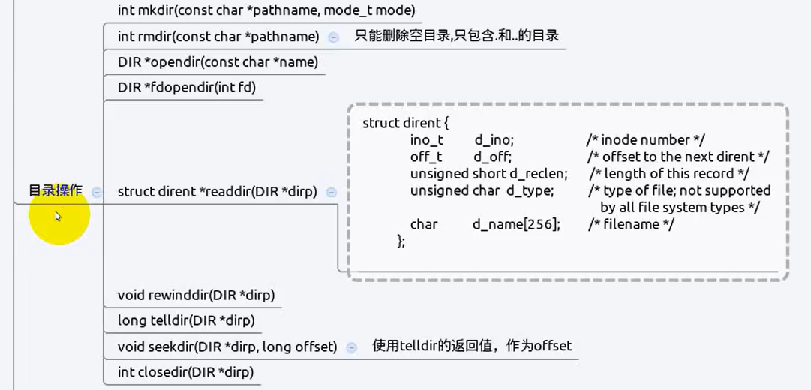

# 目录操作函数



---

## 1. `mkdir`

创建一个目录

```c++
int mkdir(const char *pathname, mode_t mode);
```

---

## 2. `rmdir`

删除一个目录

```c++
int rmdir(const char *pathname);
```

---

## 3. `opendir` / `fdopendir`

打开一个目录

```c
DIR *opendir(const char *name); 返回一个目录指针，指向目录对应的数据块
DIR *fdopendir(int fd);
```

---

## 4. `readdir`

读有`opendir`打开得到的目录指针对应数据块的记录项

```c
struct dirent *readdir(DIR *dirp);      // 每次返回一条记录项，DIR*指向下一条记录项

struct dirent {
               ino_t          d_ino;       /* Inode number */
               off_t          d_off;       /* Not an offset; see below */
               unsigned short d_reclen;    /* Length of this record */
               unsigned char  d_type;      /* Type of file; not supported
                                              by all filesystem types */
               char           d_name[256]; /* Null-terminated filename */
           };
```

---

## 5. `rewinddir`

将目录指针恢复到起始位置

```c
#include <sys/types.h>

#include <dirent.h>

void rewinddir(DIR *dirp);
```

---

## 6. `telldir`

找到当前目录指针的位置

```c
long telldir(DIR *dirp);
```

---

## 7. `seekdir`

将目录指针定位某些地方

```c
void seekdir(DIR *dirp, long loc);
```

---

## 8. `closedir`

关闭目录

```c
#include <sys/types.h>

#include <dirent.h>

int closedir(DIR *dirp);
```

---

## 9. 实现扫描目录功能

```c
#include <sys/types.h>
#include <sys/stat.h>
#include <unistd.h>
#include <dirent.h>
#include <stdio.h>
#include <string.h>
#define MAX_PATH 1024
/* dirwalk: apply fcn to all files in dir */
void dirwalk(char *dir, void (*fcn)(char *))
{
    char name[MAX_PATH];  // 存储文件名字
    struct dirent *dp;    // 数据项指针
    DIR *dfd;             // 目录指针
    if ((dfd = opendir(dir)) == NULL) {
        fprintf(stderr, "dirwalk: can't open %s\n", dir);
        return;
    }
    // 循环读取数据块中的数据项
    while ((dp = readdir(dfd)) != NULL) {
        if (strcmp(dp->d_name, ".") == 0
        || strcmp(dp->d_name, "..") == 0)
         continue; /* skip self and parent */
    if (strlen(dir)+strlen(dp->d_name)+2 > sizeof(name))  // 判断长度，防止越界
        fprintf(stderr, "dirwalk: name %s %s too long\n",
        dir, dp->d_name);
    else {
        sprintf(name, "%s/%s", dir, dp->d_name);  // name = dir + / + dp->name
        (*fcn)(name);                             // 继续当前路径是否为文件
        }
    }
    closedir(dfd); 
}
/* fsize: print the size and name of file "name" */
void fsize(char *name)
{
    struct stat stbuf;                             // 文件信息
    if (stat(name, &stbuf) == -1) {
        fprintf(stderr, "fsize: can't access %s\n", name);
        return;
    }
    if ((stbuf.st_mode & S_IFMT) == S_IFDIR)       // 判断是否为普通文件
        dirwalk(name, fsize);                      // 如果为目录，继续递归
    printf("%8ld %s\n", stbuf.st_size, name);      // 为文件即输出文件的大小和文件名
}

int main(int argc, char **argv)                    // main(int argc, char *argv[])
{
    if (argc == 1) /* default: current directory */
        fsize(".");
    else
        while (--argc > 0)                          // 从1开始  
            fsize(*++argv);                         // fsize(argv[++i])
    return 0;
}
```

---
