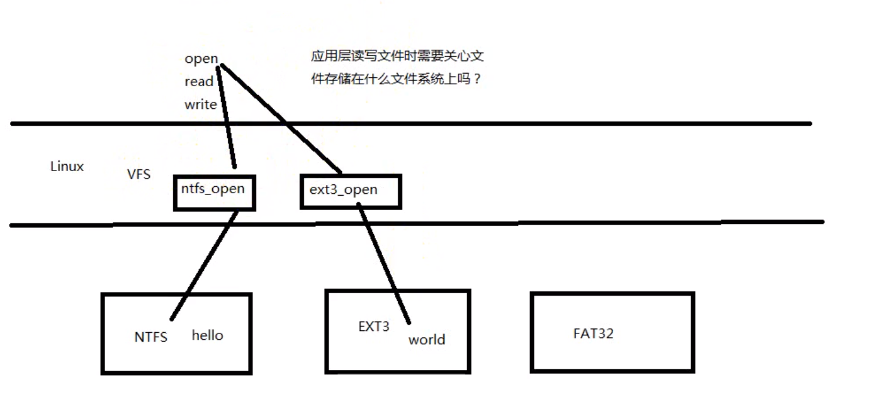
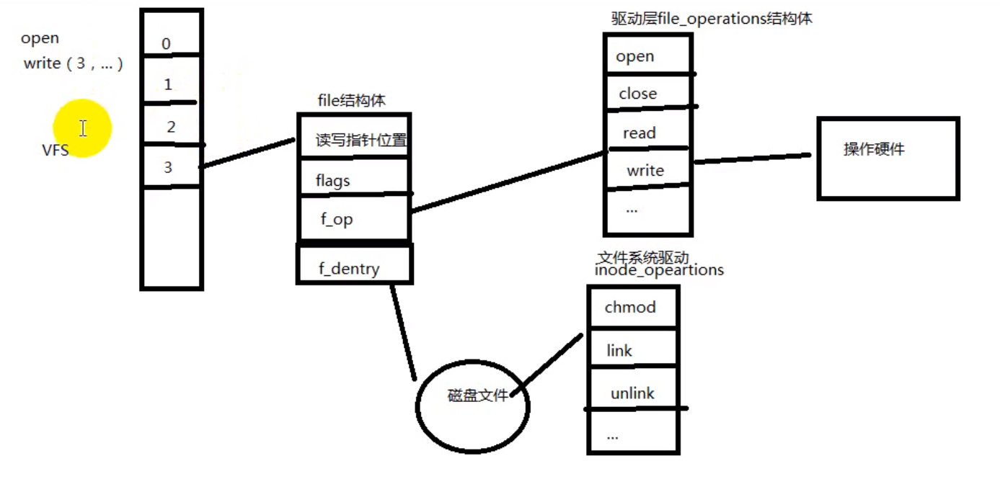

# 虚拟文件系统`vfs`

---

## 1. 何为虚拟文件系统

Linux内核在各种不同的文件系统格式之上做了一个抽象层，使得文件、目录、读写访问等概念成
为抽象层的概念，该抽象层为虚拟文件系统  

**即应用层不需要管文件是在什么存储系统上**：



---

## 2. `vfs`结构



* 每个文件描述指向一个`file`结构体
* `file`结构体中的`f_op`指向一个驱动层`file_operations`结构体，其中为一些函数，对硬件进行操作
* `file`结构体中的`f_dentry`指向磁盘文件，指向文件系统驱动`inode_operations`

---

## 3. 思考?

当先后两次`open("abc")`时，分别写入`hello` 和 `world`时，文件中数据为什么？

* 每次`open`会对应一个文件描述符，文件描述符对应着`file`结构体，不同的`file`结构体的读写指针位置不同，即后写入文件的进程会覆盖之前的内容

---

## 4. `dup/dup2`

1. 复制一个现存的文件描述符，使两个文件描述符指向同一个`file`结构体
2. 当`open`一个文件时，对应的`file`结构体中的引用计数会加1，`close`会将引用减1，如果引用计数为0，内核才会真正释放文件

```c
int dup(int oldfd);
int dup2(int oldfd, int newfd);
```

### 4.1 使用`dup/dup2`实现重定向

```c
#include <unistd.h>
#include <sys/stat.h>
#include <fcntl.h>
#include <stdio.h>
#include <stdlib.h>
#include <string.h>
int main(void)
{
int fd, save_fd;
char msg[] = "This is a test\n";
fd = open("somefile", O_RDWR|O_CREAT, S_IRUSR|S_IWUSR);
if(fd<0) {
perror("open");
exit(1);
}
save_fd = dup(STDOUT_FILENO);
dup2(fd, STDOUT_FILENO);
close(fd);
write(STDOUT_FILENO, msg, strlen(msg));
dup2(save_fd, STDOUT_FILENO);
write(STDOUT_FILENO, msg, strlen(msg));
close(save_fd)
```

## 5. 练习
