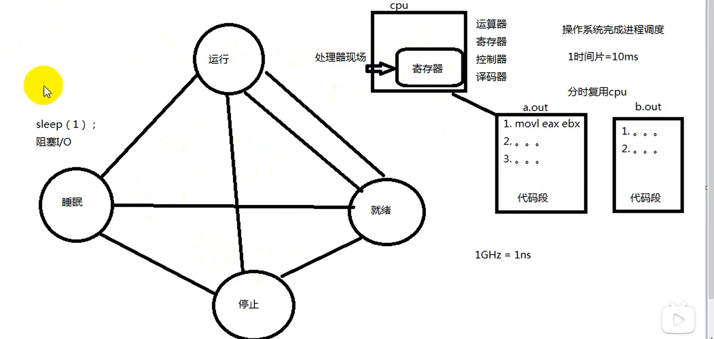

# 进程状态

- [进程状态](#进程状态)
  - [查看进程的资源限制](#查看进程的资源限制)
  - [修改进程资源限制](#修改进程资源限制)



---

## 查看进程的资源限制

```c
cat /proc/self/limits
ulimit -a
```

---

## 修改进程资源限制

```c
#include <sys/time.h>
#include <sys/resource.h>

int getrlimit(int resource, struct rlimit *rlim);
int setrlimit(int resource, const struct rlimit *rlim);
```

---
