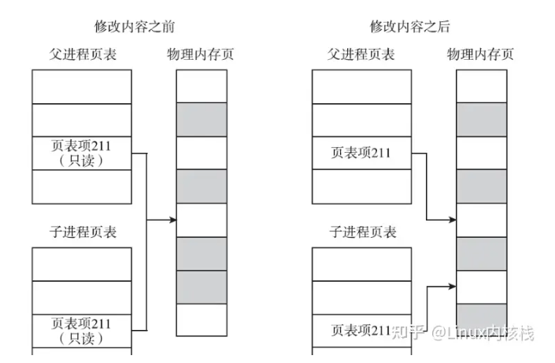

# 进程原语

---

## 1. `fork`


* 子进程会复制父进程`0~3G`的空间和父进程内核中的PCB，但是ID号不同
* 子进程和父进程运行结果不同，因为虚拟地址相同，但是对应的物理地址不同

```c
#include <sys/types.h>
#include <unistd.h>

pid_t fork(void);  // 当fork时，父和子都出来了
```

`fork`调用一次返回两次

```c
+ 父进程中返回子进程PID
+ 子进程中返回0
+ 读时共享，写时复制
```

---

## 2. `读时共享，写时复制`



* 当读取文件，没有对文件进行操作时，父和子共享一个页面
* 当对文件修改时，就会创建一个新的物理界面，然后进行复制

---

## 3. 获取进程号

* `getpid`获取当前调用的进程的`PID`
* `getppid`获取当前调用的进程的父进程的`PID`

```c
#include <sys/types.h>
#include <unistd.h>

pid_t getpid(void);   // 获取当前调用的进程PID
pid_t getppid(void);  // 获取当前调用的进程的父进程的PID 
```

**例如**：

```c
#include <stdio.h>
#include <unistd.h>
#include <sys/types.h>
#include <stdlib.h>

int main(void)
{
    pid_t pid;
    pid = fork();  // fork时，父和子就出现了
    int n=10;
    if(pid>0){
        while(1){       // 父进程
        printf("I am parent %d, ",n++);
        printf("my pid = %d\n",getpid());  // 获取当前进程的PID
        sleep(1);
        }
    }
    else if(pid == 0){  // 子进程
        while(1){
        printf("I am son %d, ",n+=10);  
        printf("my pid = %d, ",getpid());
        printf("my parent pid = %d\n",getppid());   // 当前进程的父进程的PID
        sleep(3);
        }
    }
    else {
        perror("fork");
        exit(1);
    }

    return 0;
}

```

---

## 4. `getuid/geteuid`

* `getuid`：返回实际用户ID
* `geteuid`：返回有效用户ID

```c
#include <unistd.h>
#include <sys/types.h>

uid_t getuid(void);    // 返回实际用户ID
uid_t geteuid(void);   // 返回有效用户ID
```

---

## 5. `getgid/getegid`

* `getgid`：返回实际用户组
* `getegid`：返回有效用户组

```c
#include <unistd.h>
#include <sys/types.h>

gid_t getgid(void);    // 返回实际用户ID
gid_t getegid(void);   // 返回有效用户ID 
```

---

## 6. `exec族`

```c
#include <unistd.h>

extern char **environ;

int execl(const char *pathname, const char *arg, .../* (char  *) NULL */);

int execlp(const char *file, const char *arg, .../* (char  *) NULL */);

int execle(const char *pathname, const char *arg, .../*, (char *) NULL, char *const envp[] */);

int execv(const char *pathname, char *const argv[]);

int execvp(const char *file, char *const argv[]);

int execvpe(const char *file, char *const argv[],char *const envp[]);
```

* 当进程调用一种exec函数时，该进程的用户空间代码和数据完全被新程序替换，从新程序的启动例程开始执行
* 调用exec并不创建新进程，所以调用exec前后该进程的id并未改变

```c

```
