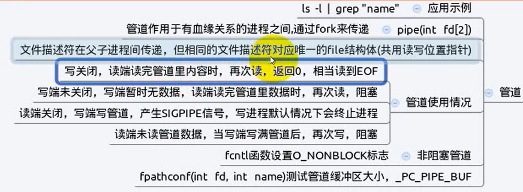
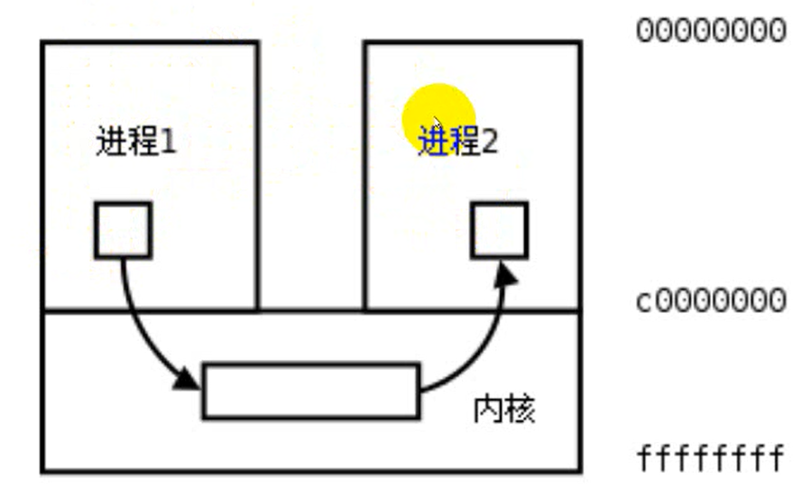
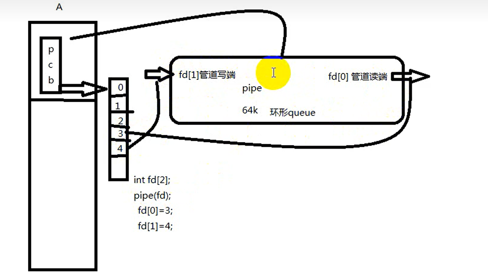
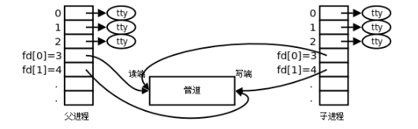

# 进程间通信(IPC)



---

## 1. 概念

进程有不同的用户地址空间，任何一个进程的全局变量在另一个进程中都看不见，进程间交换数据通过内核，内核中开辟一块缓冲区，将数据从用户空间拷贝到内核缓冲区，其他进程在读取



---

## 2. `pipe`管道

管道在内核



```c
#include <unistd.h>

int pipe(int filedes[2]);
```

* `filedes`为文件描述符
* `filedes[0]`指向管道的读端
* `filedes[1]`指向管道的写端

**单工通信**，**要确定读写方向**:

* 父写子读，关闭父读，关闭子写
* 子写父读，关闭子读，关闭父写

```c
#include <stdio.h>
#include <unistd.h>
#include <sys/stat.h>
#include <sys/types.h>
#include <string.h>
#include <wait.h>
#include <stdlib.h>

int main(void)
{
    char str[1024]="hello world!";
    char buf[1024]="";
    int fd[2];
    pipe(fd);  // 管道
    pid_t pid;

    pid=fork();
    if(pid > 0){
        // 父进程，父写
        close(fd[0]);  // 关闭父读
        sleep(2); 
        write(fd[1], str, strlen(str));
        wait(NULL);  // 回收子进程
    }
    else if(pid == 0){
        // 子进程，子读
        close(fd[1]);  // 关闭子写
        int len;
        len = read(fd[0],buf,sizeof(buf));
        write(STDOUT_FILENO,buf,strlen(buf));
    }
    else{
        perror("fork");
        exit(1);
    }

    return 0;
}
```



### 2.1 注意

* 管道是单向通道
* 写关闭，读端读完管道里内容时，再次读，返回0，相当于读到`EOF`
* 写端未关闭，写端暂时无数据，读端读完管道里的数据时，再读，阻塞
* 读端关闭，写端写管道，产生`SIGPIPE`信号，写进程默认情况下会终止进程
* 读端未读管道数据，当写端写满管道后，再次写，阻塞

---
