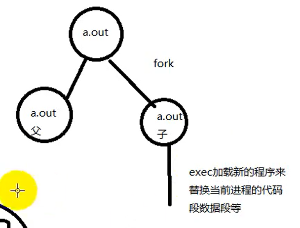
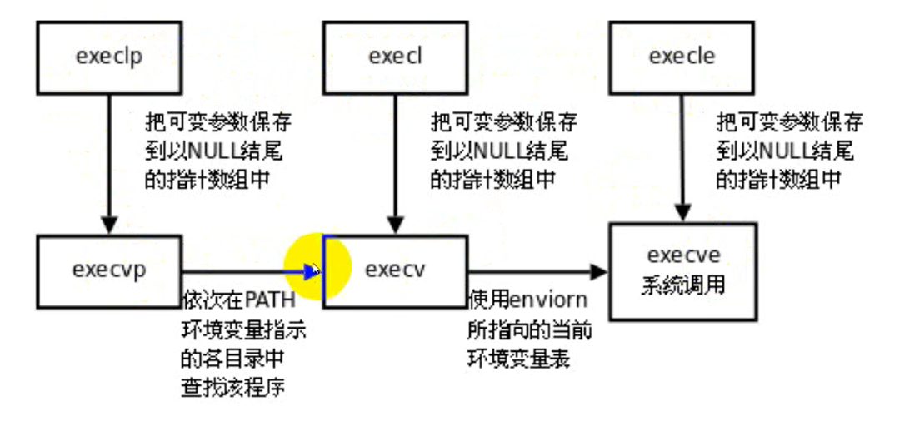
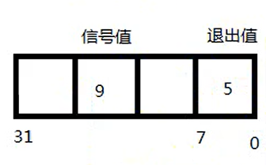

# 进程原语

- [进程原语](#进程原语)
  - [1. `fork`](#1-fork)
  - [2. `读时共享，写时复制`](#2-读时共享写时复制)
  - [3. 获取进程号](#3-获取进程号)
  - [4. `getuid/geteuid`](#4-getuidgeteuid)
  - [5. `getgid/getegid`](#5-getgidgetegid)
  - [6. `exec族`](#6-exec族)
    - [6.1 `fork-exec组合`](#61-fork-exec组合)
    - [6.2 注意](#62-注意)
  - [7. `wait/waitpid`](#7-waitwaitpid)
    - [僵尸进程](#僵尸进程)
    - [`wait`](#wait)
    - [`waitpid`](#waitpid)
    - [孤儿进程](#孤儿进程)

---

## 1. `fork`


* 子进程会复制父进程`0~3G`的空间和父进程内核中的PCB，但是ID号不同
* 子进程和父进程运行结果不同，因为虚拟地址相同，但是对应的物理地址不同

```c
#include <sys/types.h>
#include <unistd.h>

pid_t fork(void);  // 当fork时，父和子都出来了
```

`fork`调用一次返回两次

```c
+ 父进程中返回子进程PID
+ 子进程中返回0
+ 读时共享，写时复制
```

---

## 2. `读时共享，写时复制`


* 当读取文件，没有对文件进行操作时，父和子共享一个页面
* 当对文件修改时，就会创建一个新的物理界面，然后进行复制

---

## 3. 获取进程号

* `getpid`获取当前调用的进程的`PID`
* `getppid`获取当前调用的进程的父进程的`PID`

```c
#include <sys/types.h>
#include <unistd.h>

pid_t getpid(void);   // 获取当前调用的进程PID
pid_t getppid(void);  // 获取当前调用的进程的父进程的PID 
```

**例如**：

```c
#include <stdio.h>
#include <unistd.h>
#include <sys/types.h>
#include <stdlib.h>

int main(void)
{
    pid_t pid;
    pid = fork();  // fork时，父和子就出现了
    int n=10;
    if(pid>0){
        while(1){       // 父进程
        printf("I am parent %d, ",n++);
        printf("my pid = %d\n",getpid());  // 获取当前进程的PID
        sleep(1);
        }
    }
    else if(pid == 0){  // 子进程
        while(1){
        printf("I am son %d, ",n+=10);  
        printf("my pid = %d, ",getpid());
        printf("my parent pid = %d\n",getppid());   // 当前进程的父进程的PID
        sleep(3);
        }
    }
    else {
        perror("fork");
        exit(1);
    }

    return 0;
}

```

---

## 4. `getuid/geteuid`

* `getuid`：返回实际用户ID
* `geteuid`：返回有效用户ID

```c
#include <unistd.h>
#include <sys/types.h>

uid_t getuid(void);    // 返回实际用户ID
uid_t geteuid(void);   // 返回有效用户ID
```

---

## 5. `getgid/getegid`

* `getgid`：返回实际用户组
* `getegid`：返回有效用户组

```c
#include <unistd.h>
#include <sys/types.h>

gid_t getgid(void);    // 返回实际用户ID
gid_t getegid(void);   // 返回有效用户ID 
```

---

## 6. `exec族`



```c
#include <unistd.h>

extern char **environ;

char *envp[]={...}

// 要指明路径
int execl(const char *pathname, const char *arg, .../* (char  *) NULL */);

// 通过echo $PATH去找命令，所以不用指明路径，只需指明路径 
int execlp(const char *file, const char *arg, .../* (char  *) NULL */);

// 可以加环境变量envp[]
int execle(const char *pathname, const char *arg, .../*, (char *) NULL, char *const envp[] */);

// 传递指针数组
int execv(const char *pathname, char *const argv[]);

// 传递指针数组，不用指明路径
int execvp(const char *file, char *const argv[]);

int execvpe(const char *file, char *const argv[],char *const envp[]);
```

* 当进程调用一种`exec`函数时，该进程的用户空间代码和数据完全被新程序替换，从新程序的启动例程开始执行
* 调用`exec`并不创建新进程，所以调用`exec`前后该进程的`id`并未改变



```c
#include <stdio.h>
#include <unistd.h>

int main(void)
{
    printf("hello\n");
    execl("/usr/bin/ls","ls","-l",NULL);   // 直接去执行ls -l 命令
    printf("world\n");                     // 不会执行后面

    return 0;
}
```

### 6.1 `fork-exec组合`

当`fork`后，子进程就使用`exec`运行新的程序

```c
#include <stdio.h>
#include <unistd.h>
#include <stdlib.h>

int main(void)
{
    pid_t pid;
    pid=fork();

    if(pid == 0){
        /* son */
        printf("I am son\n");
        execl("/usr/bin/ls", "ls", "-l", NULL);  // 子进程中运行新的代码段
    }
    else if(pid > 0){
        /* parent */
        while(1){
            printf("I am parent");
            sleep(1);
        }        
    }
}
```

### 6.2 注意

* 当使用`execlp`时，`argv[1]`会被跳过
* 当`execlp`通过`PATH`以及在当前路径下中找到时，不会执行

```c
execlp("ls", "aaaa", "-l", NULL);  此时aaaa不会有影响，通过PATH找到ls后，直接跳过argv[1]，使用argv[2]
```

---

## 7. `wait/waitpid`

**进程释放**：用户空间释放 + PCB释放

### 僵尸进程

* 如果一个进程已经终止，但是它的父进程尚未调用wait或waitpid对它进行清理，这时
的进程状态称为僵尸（Zombie）进程，此时用户空间释放，但是PCB未释放
* 子进程退出，父进程没有回收子进程资源（PCB），则子进程变成僵尸进程

```c
#include <sys/types.h>
#include <sys/wait.h>

pid_t wait(int *wstatus);  

pid_t waitpid(pid_t pid, int *wstatus, int options);

int waitid(idtype_t idtype, id_t id, siginfo_t *infop, int options);
```

* `wait`是一个阻塞函数,等待回收子进程资源，如果没有子进程，`wait`返回-1

### `wait`

* 当使用`wait(int *wstatus)`时，可以通过指针返回子进程回收原因
* 当使用`wait(NULL)`时，不关心回收原因

`wstatus`**指针指向**：



### `waitpid`

非阻塞函数

```c
pid_t waitpid(pid_t pid, int *wstatus, int options);

pid:
    < -1：回收指定进程组内的任意子进程
    = -1: 回收任意子进程
    = 0 : 回收和当前调用waitpid一个组的所有子进程
    > 0 ：回收指定ID的子进程

options:
    WNOHANG：不希望被阻塞，如果没有子进程终止会立即返回0，不等待，如果结束了就返回进程号
    ...

status: 可以通过宏函数得到 man page
```

### 孤儿进程

* 父进程先于子进程结束，则子进程成为孤儿进程。
* 子进程的父进程成为1号`init`进程，`init`进程领养孤儿进程

---
