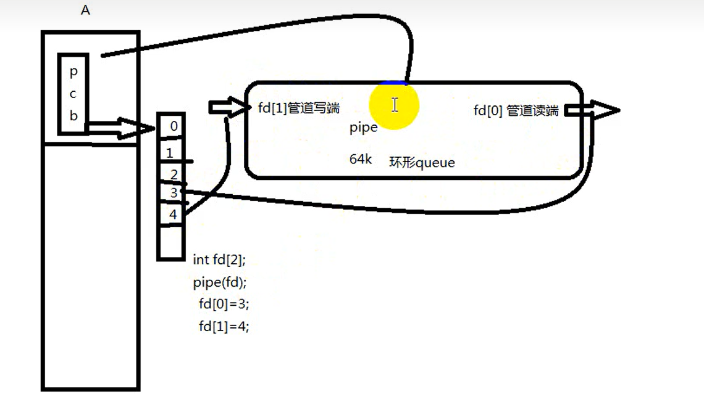

# `pipe`管道

- [`pipe`管道](#pipe管道)
  - [1. 概念](#1-概念)
  - [2. `pipe`管道](#2-pipe管道)
    - [2.1 注意](#21-注意)
    - [2.2 测试管道缓冲区大小](#22-测试管道缓冲区大小)
    - [2.3 非阻塞管道](#23-非阻塞管道)


---

## 1. 概念

进程有不同的用户地址空间，任何一个进程的全局变量在另一个进程中都看不见，进程间交换数据通过内核，内核中开辟一块缓冲区，将数据从用户空间拷贝到内核缓冲区，其他进程在读取



---

## 2. `pipe`管道

解决有血缘关系进程之间的通信


```c
#include <unistd.h>

int pipe(int filedes[2]);
```

- `filedes`为文件描述符
- `filedes[0]`指向管道的读端
- `filedes[1]`指向管道的写端

**单工通信**，**要确定读写方向**:

单向通信：子父进程共享同一个`fifo`结构体

- 父写子读，关闭父读，关闭子写
- 子写父读，关闭子读，关闭父写

```c
#include <stdio.h>
#include <unistd.h>
#include <sys/stat.h>
#include <sys/types.h>
#include <string.h>
#include <wait.h>
#include <stdlib.h>

int main(void)
{
    char str[1024]="hello world!";
    char buf[1024]="";
    int fd[2];
    pipe(fd);  // 管道
    pid_t pid;

    pid=fork();
    if(pid > 0){
        // 父进程，父写
        close(fd[0]);  // 关闭父读
        sleep(2); 
        write(fd[1], str, strlen(str));
        wait(NULL);  // 回收子进程
    }
    else if(pid == 0){
        // 子进程，子读
        close(fd[1]);  // 关闭子写
        int len;
        len = read(fd[0],buf,sizeof(buf));
        write(STDOUT_FILENO,buf,strlen(buf));
    }
    else{
        perror("fork");
        exit(1);
    }

    return 0;
}
```


### 2.1 注意

- 管道是单向通道
- 写关闭，读端读完管道里内容时，再次读，返回0，相当于读到`EOF`
- 写端未关闭，写端暂时无数据，读端读完管道里的数据时，再读，阻塞
- 读端关闭，写端写管道，产生`SIGPIPE`信号，写进程默认情况下会终止进程
- 读端未读管道数据，当写端写满管道后，再次写，阻塞

### 2.2 测试管道缓冲区大小

```c
long fpathconf(int id, int name);  name = PC_PIPE_BUF  即测试管道大小

例如：
int fd[2];
pipe(fd);
printf("%ld", fpathconf(fd[0], _PC_PIPE_BUF)); 
```

### 2.3 非阻塞管道

非阻塞管道, fcntl函数设置O_NONBLOCK标志

```c
例如：
int flags;
int fd[2];
pipe(fd);
flags = fcntl(fd[0], F_GETFL);
flags |= NONBLOCK;
fcntl(fd[0], F_SETFL, flags);
```

---
