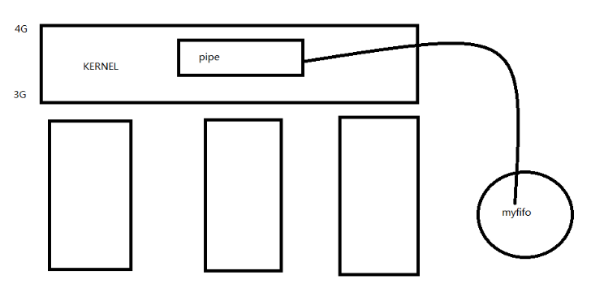

# `fifo`有名管道

- [`fifo`有名管道](#fifo有名管道)
  - [1. 概念](#1-概念)
  - [2. `mkfifo`命令](#2-mkfifo命令)
  - [3. `mkfifo`函数](#3-mkfifo函数)

---

## 1. 概念

解决无血缘关系的进程间通信



磁盘文件指向内核中的`pipe`

---

## 2. `mkfifo`命令

**创建**`fifo`**文件**：

```c
mkfifo xwp  创建fifo文件
```


`fifo`文件在磁盘当中占一个结点，去索引内核当中的缓冲区

```c
int fd = open(xwp, O_WRONLY);
write(fd, buf, strlen(buf));  // 向fifo管道中写

int fd = open(xwp, O_RDONLY);
int len = read(fd, buf, sizeof(buf));  // 读取管道中内容
```

**注意**：

- 当只写打开`fifo`管道时，如果没有`fifo`没有读端打开，则`open`写打开会阻塞
- `fifo`内核实现时支持双向通信
- `fifo`可以一个读端，多个写端；也可以一个写端，多个读端

---

## 3. `mkfifo`函数

```c
#include <sys/types.h>
#include <sys/stat.h>

int mkfifo(const char *pathname, mode_t mode);
```

**例如**：

```c
int flags = mkfifo(argv[1], 0666);
if(flags == -1){
    perror("mkfifo");
    exit(1);
}
int fd = open(argv[1], O_WRONLY);
```

---
