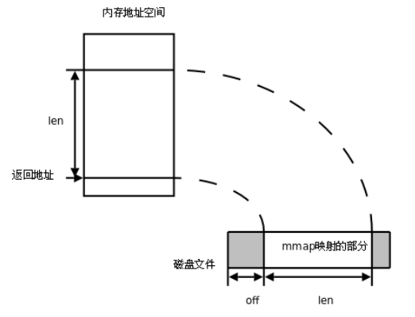
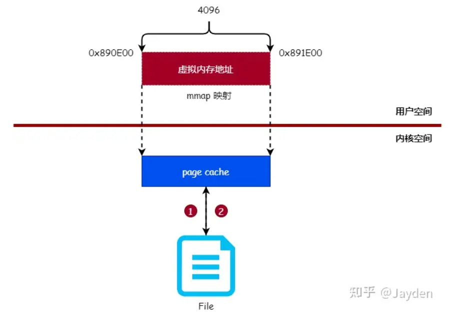
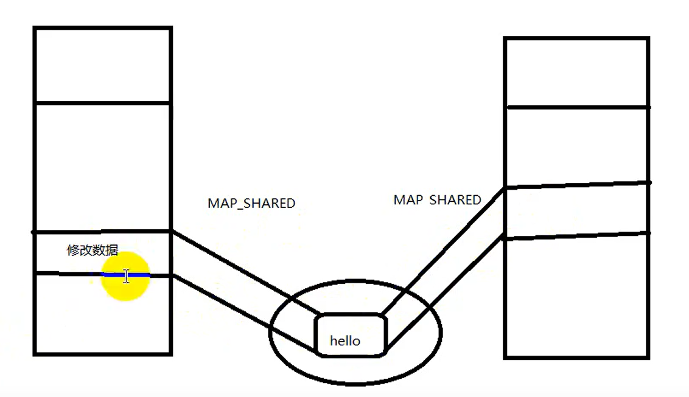

# 内存共享映射

- [内存共享映射](#内存共享映射)
  - [1. 传统读写和`mmap`](#1-传统读写和mmap)
  - [2. `mmap/munmap`](#2-mmapmunmap)
  - [2. 实现进程通信](#2-实现进程通信)



---

## 1. 传统读写和`mmap`


传统读写通过将文件读到内存中后修改后再存入到文件中

**优化**：

- 如果可以直接在用户空间读写页缓存，那么就可以免去将页缓存的数据复制到用户空间缓冲区的过程

---

## 2. `mmap/munmap`



`mmap`通过页缓存映射到内存中，即文件中的位置对应内存地址，对文件读写可以直接用指针

```c
#include <sys/mman.h>

void *mmap(void *addr, size_t length, int prot, int flags,int fd, off_t offset);

addr：从什么位置开始映射

length：需要映射的那一部分文件的长度

port：
    PORT_EXEC：表示映射的那一段可执行
    PORT_READ：映射的那一段可读
    PORT_WRITE：映射的那一段可写
    PORT_NONE：映射的那一段不可访问

flags：
    MAP_SHARED：多个进程对同一个文件的映射是共享的，一个修改后另一个同步
    MAP_PRIVATE：映射不是共享的，一个修改后并不会同步
    ...

fd：文件描述符，映射到内存上的磁盘文件

offset：偏移量，必须是页的大小的整数倍

int munmap(void *addr, size_t length);
```

`mmap`成功返回映射的首地址，失败返回`MAP_FAILED`，当进程终止时，进程的内存映射会自动解除

**失败情况**：

- 内存空间不足
- 权限不对

```c
#include <stdio.h>
#include <unistd.h>
#include <sys/stat.h>
#include <sys/types.h>
#include <sys/mman.h>
#include <stdlib.h>
#include <fcntl.h>

int main(void)
{
    int fd, len;
    int *p;
    fd = open("hello", O_RDWR);
    if(fd < 0){
        perror("open");
        exit(1);
    }
    len = lseek(fd, 0, SEEK_END);  // 文件大小
    p = mmap(NULL, len, PROT_READ | PROT_WRITE, MAP_SHARED, fd, 0);  // 建立映射

    if(p == MAP_FAILED){  // 映射出错
        perror("mmap");
        exit(1);
    }
    p[0] = 0x31323334;  // 进行修改
    close(fd);
    munmap(mm, len);
    return 0;
}
```

---

## 2. 实现进程通信



**对文件写**：

```c
#include <stdio.h>
#include <unistd.h>
#include <sys/stat.h>
#include <sys/types.h>
#include <sys/mman.h>
#include <stdlib.h>
#include <fcntl.h>
#define MAPLEN 0x1000
void sys_err(char *errname, int errno)
{
    perror(errname);
    exit(errno);
}

int main(int argc, char *argv[])
{
    int fd;
    char *mm;
    if(argc < 2){
        printf("./a.out filename\n");
        exit(1);
    }
    fd = open(argv[1], O_RDWR | O_CREAT, 0777);  // 读写打开文件，如果没有该文件，创建
    if(fd < 0){
        sys_err("open", 2);
    }
    if(lseek(fd, MAPLEN-1, SEEK_SET) < 0){  // 给文件追加空间，不然文件是空的，会报错
        sys_err("lseek", 3);
    }
    if(write(fd, "\0", 1) < 0){
        sys_err("write", 4);
    }
    mm = mmap(NULL, MAPLEN, PROT_READ | PROT_WRITE, MAP_SHARED, fd, 0);  // 建立映射 
    if(mm == MAP_FAILED){
        sys_err("mmap", 5);
    }
    close(fd);
    int i = 0;
    while(1){  // 向文件中写
        sprintf(mm, "hello%d\n", i++);
        sleep(1);
    }
    munmap(mm, MAPLEN);  // 关闭映射

    return 0;
}
```

**对文件读**：

```c
#include <stdio.h>
#include <unistd.h>
#include <sys/stat.h>
#include <sys/types.h>
#include <sys/mman.h>
#include <stdlib.h>
#include <fcntl.h>
#define MAP_LEN 0x1000
void sys_err(char *errname, int errno)
{
    perror(errname);
    exit(errno);
}

int main(int argc, char *argv[])
{
    int fd, len;
    char *mm;
    if(argc < 2){
        printf("./a.out filename");
        exit(1);
    }
    fd = open(argv[1], O_RDWR);  // 读写打开文件
    if(fd < 0){
        sys_err("open", 2);
    }
    if((len = lseek(fd, 0, SEEK_END)) < 0){  // 读取文件长度  
        sys_err("lseek", 3);
    }
    mm = mmap(NULL, len, PROT_READ | PROT_WRITE, MAP_SHARED, fd, 0);  // 建立映射 
    if(mm == MAP_FAILED){
        sys_err("mmap", 4);
    }
    int i = 0;
    while(1){
        printf("%s", mm);  // 读取玩家文件中的内容
        sleep(1);
    }
    munmap(mm, len);
    close(fd);

    return 0;
}
```

**注意**：

- 用于进程间通信时，一般设计成结构体，来传输通信的数据
- 应该创建临时文件来用于进程间通信 即使用`unlink`删除文件，当读取完文件后，将文件删除
- 当报总线错误时，优先查看共享文件是否为空

---
